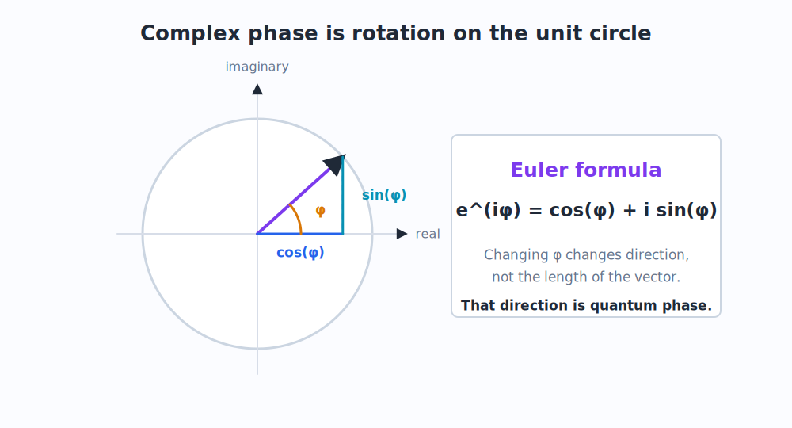

# 2. Math and Algebra Prerequisites

This chapter is the mathematical toolkit for the rest of the book. It is deliberately practical. The goal is not abstract elegance for its own sake, but fluency with the objects that quantum mechanics uses every few lines.

The core objects are:

- complex numbers,
- sine and cosine,
- Euler's formula,
- vectors and bases,
- inner products,
- matrices,
- unitary transformations,
- probability from squared magnitude.

Whenever a later chapter says "phase", "basis", "projection", "gate", or "unitary", it is using material from this chapter.

## 2.1 Complex Numbers

**Question.** Why do quantum amplitudes use complex numbers instead of ordinary real numbers?

**Teacher.** Because quantum states need a built-in notion of phase, and phase is naturally represented as rotation in the complex plane.

A complex number has the form:

```math
z = a + ib
```

where:

```math
i^2 = -1
```

The number $a$ is the real part. The number $b$ is the imaginary part.

The magnitude is:

```math
|z| = \sqrt{a^2 + b^2}
```

The squared magnitude is:

```math
|z|^2 = a^2 + b^2
```

Quantum probabilities come from squared magnitudes:

```math
P = |\psi|^2
```

This is why a complex amplitude can be negative, imaginary, or phase-shifted, while the final probability remains a nonnegative real number.

## 2.2 The Complex Plane

You can picture $z = a + ib$ as a point or vector:

- horizontal coordinate $a$,
- vertical coordinate $b$.

For example:

```math
1 = 1 + 0i
```

points to the right, while

```math
i = 0 + 1i
```

points upward.

The number

```math
-1 = -1 + 0i
```

points left.

This matters because amplitudes can cancel as vectors:

```math
1 + (-1) = 0
```

They can also cancel after rotating through phases, not only by being literally positive and negative real numbers.

## 2.3 Sine and Cosine as Coordinates

The trigonometric functions $\cos\theta$ and $\sin\theta$ are coordinates on the unit circle.

If a point lies on a circle of radius 1 at angle $\theta$, then:

```math
x = \cos\theta
\qquad
y = \sin\theta
```

The identity:

```math
\cos^2\theta + \sin^2\theta = 1
```

is the statement that the point remains on the unit circle.

This identity reappears in qubits. A single-qubit state often uses:

```math
\cos\frac{\theta}{2}
\quad\text{and}\quad
\sin\frac{\theta}{2}
```

as amplitude magnitudes. The squared magnitudes add to 1:

```math
\cos^2\frac{\theta}{2} + \sin^2\frac{\theta}{2} = 1
```

That is exactly what we need for probabilities to sum to 1.

## 2.4 Euler's Formula

Euler's formula is the bridge between trigonometry and complex phase:

```math
e^{i\phi} = \cos\phi + i\sin\phi
```

This says that $e^{i\phi}$ is a unit-length complex number at angle $\phi$.

Its magnitude is always 1:

```math
|e^{i\phi}| = 1
```

So multiplying an amplitude by $e^{i\phi}$ changes its direction in the complex plane without changing its magnitude.

That is phase.



## 2.5 Why Phase Can Be Invisible

Suppose:

```math
\psi = e^{i\phi}
```

Then:

```math
|\psi|^2 = |e^{i\phi}|^2 = 1
```

So if you look only at this one amplitude's magnitude, the phase does not change the probability.

That is the origin of a common phrase:

> Phase does not affect probability.

But that phrase is incomplete. Phase may be invisible when measuring one component directly. It becomes visible when amplitudes are added before squaring.

For example:

```math
\left|\frac{1 + e^{i\phi}}{2}\right|^2
=
\cos^2\frac{\phi}{2}
```

At $\phi = 0$, this equals 1. At $\phi = \pi$, this equals 0.

Same magnitude for the individual phase factor, completely different probability after recombination.

This is the algebraic heart of interference.

## 2.6 Vectors

A vector is an ordered list of numbers. In quantum mechanics, those numbers are often complex.

The computational basis states of a qubit are written:

```math
|0\rangle =
\begin{pmatrix}
1 \\
0
\end{pmatrix}
\qquad
|1\rangle =
\begin{pmatrix}
0 \\
1
\end{pmatrix}
```

A general qubit is:

```math
|\psi\rangle =
\alpha |0\rangle + \beta |1\rangle
=
\begin{pmatrix}
\alpha \\
\beta
\end{pmatrix}
```

The coefficients $\alpha$ and $\beta$ are complex amplitudes.

The normalization condition is:

```math
|\alpha|^2 + |\beta|^2 = 1
```

This condition ensures that measurement probabilities sum to 1.

## 2.7 Basis

A basis is a set of reference vectors used to describe a state.

The same vector can be described in different bases, just as the same physical direction in space can be described using north/east coordinates or using rotated axes.

For qubits, the most important bases are:

The Z basis:

```math
|0\rangle
\qquad
|1\rangle
```

The X basis:

```math
|+\rangle =
\frac{|0\rangle + |1\rangle}{\sqrt{2}}
\qquad
|-\rangle =
\frac{|0\rangle - |1\rangle}{\sqrt{2}}
```

Why those formulas?

First, the X-basis states are still being written using the Z-basis coordinates $|0\rangle$ and $|1\rangle$. That is like describing a rotated pair of axes using the old horizontal and vertical coordinates.

The raw vector

```math
|0\rangle + |1\rangle
=
\begin{pmatrix}
1 \\
1
\end{pmatrix}
```

has squared length:

```math
1^2 + 1^2 = 2
```

So it is too long to be a normalized quantum state. We divide by $\sqrt{2}$ because:

```math
\left|\frac{1}{\sqrt{2}}\right|^2
+
\left|\frac{1}{\sqrt{2}}\right|^2
=
\frac{1}{2} + \frac{1}{2}
=
1
```

That is why the denominator is $\sqrt{2}$, not $2$. Amplitudes are squared to become probabilities.

Second, the two basis states must be mutually exclusive measurement answers. Mathematically, that means they must be orthogonal:

```math
\langle +|-\rangle
=
\frac{1}{2}(1 - 1)
=
0
```

The plus state and minus state contain the same Z-basis magnitudes, but their relative sign is different. That relative sign is a phase difference. Measuring in the X basis asks:

```text
Is the state aligned with |+> or with |->?
```

It is not asking whether the state is $|0\rangle$ or $|1\rangle$.

You can also reverse the equations:

```math
|0\rangle =
\frac{|+\rangle + |-\rangle}{\sqrt{2}}
\qquad
|1\rangle =
\frac{|+\rangle - |-\rangle}{\sqrt{2}}
```

So neither basis is more real than the other. They are two coordinate systems for the same two-dimensional state space.

The Y basis:

```math
|+i\rangle =
\frac{|0\rangle + i|1\rangle}{\sqrt{2}}
\qquad
|-i\rangle =
\frac{|0\rangle - i|1\rangle}{\sqrt{2}}
```

The Y basis follows the same pattern as the X basis, except the relative phase is $\pm i$ instead of $\pm 1$. Multiplication by $i$ is a 90-degree phase rotation. So the Y basis is another pair of normalized, orthogonal axes:

```math
|+i\rangle =
\frac{1}{\sqrt{2}}
\begin{pmatrix}
1 \\
i
\end{pmatrix}
\qquad
|-i\rangle =
\frac{1}{\sqrt{2}}
\begin{pmatrix}
1 \\
-i
\end{pmatrix}
```

The important idea is:

> A measurement basis is a choice of questions. The basis vectors are the possible answers to that question.

Read these as:

- "ket plus",
- "ket minus",
- "ket plus i",
- "ket minus i".

These states will become the axes of the Bloch sphere in [Chapter 4](04_qubits_and_bloch_sphere.md), and the measurement bases in [Chapter 5](05_measurement_bases.md).

## 2.8 Inner Products

An inner product measures overlap between vectors.

For complex vectors, the bra corresponding to a ket is the conjugate transpose. If:

```math
|\psi\rangle =
\begin{pmatrix}
\alpha \\
\beta
\end{pmatrix}
```

then:

```math
\langle \psi| =
\begin{pmatrix}
\alpha^* & \beta^*
\end{pmatrix}
```

The star means complex conjugate:

```math
(a + ib)^* = a - ib
```

The amplitude for state $|\psi\rangle$ to be found in basis state $|\phi\rangle$ is:

```math
\langle \phi|\psi\rangle
```

The probability is:

```math
P(\phi) = |\langle \phi|\psi\rangle|^2
```

This is how we compute measurement probabilities in any basis.

## 2.9 Matrices

A matrix is a linear transformation. A single-qubit gate is represented by a $2 \times 2$ matrix:

```math
U =
\begin{pmatrix}
a & b \\
c & d
\end{pmatrix}
```

It acts on a state vector:

```math
U|\psi\rangle
```

For example, if:

```math
|\psi\rangle =
\begin{pmatrix}
\alpha \\
\beta
\end{pmatrix}
```

then:

```math
U|\psi\rangle =
\begin{pmatrix}
a\alpha + b\beta \\
c\alpha + d\beta
\end{pmatrix}
```

Notice the sums. Matrix multiplication is one place where amplitudes naturally recombine.

## 2.10 How a Gate Becomes a Matrix

**Question.** How do we get the actual matrix of a gate from ket notation?

**Teacher.** A linear map is determined by what it does to basis vectors. The images of the basis vectors become the columns of the matrix.

Suppose:

```math
U|0\rangle = a|0\rangle + c|1\rangle
```

and:

```math
U|1\rangle = b|0\rangle + d|1\rangle
```

Then:

```math
U =
\begin{pmatrix}
a & b \\
c & d
\end{pmatrix}
```

The first column is $U|0\rangle$. The second column is $U|1\rangle$.

This will be used repeatedly in [Gates, Matrices, and Rotations](06_gates_matrices_rotations.md).

## 2.11 Unitary Matrices

Quantum evolution without measurement is represented by unitary matrices.

A matrix $U$ is unitary if:

```math
U^\dagger U = I
```

Here $U^\dagger$ is the conjugate transpose of $U$.

The practical meaning is:

> Unitary transformations preserve total probability.

If:

```math
|\alpha|^2 + |\beta|^2 = 1
```

then after applying a unitary gate:

```math
|\psi'\rangle = U|\psi\rangle
```

the new amplitudes still satisfy:

```math
|\alpha'|^2 + |\beta'|^2 = 1
```

That is why ordinary gates are reversible. Measurement is the non-unitary step where a classical outcome is produced.

## 2.12 The Born Rule

The Born rule is the rule that converts quantum amplitude into probability.

If a state is:

```math
|\psi\rangle =
\alpha |0\rangle + \beta |1\rangle
```

then measurement in the Z basis gives:

```math
P(0) = |\alpha|^2
\qquad
P(1) = |\beta|^2
```

More generally, if measuring in a basis containing $|\phi\rangle$:

```math
P(\phi) = |\langle \phi|\psi\rangle|^2
```

This is the formula that connects all the later examples:

- double slit screen probabilities,
- X-basis measurement,
- Y-basis measurement,
- final circuit readout,
- phase-sensitive sensing.

## 2.13 Summary

Keep this compact map nearby:

| Concept | Formula | Meaning |
|---|---|---|
| Complex number | $z=a+ib$ | amplitude with direction and magnitude |
| Magnitude | $\lvert z\rvert=\sqrt{a^2+b^2}$ | length in complex plane |
| Probability | $P=\lvert\psi\rvert^2$ | squared amplitude magnitude |
| Phase | $e^{i\phi}$ | unit rotation in complex plane |
| Qubit | $\lvert\psi\rangle=\alpha\lvert0\rangle+\beta\lvert1\rangle$ | two complex amplitudes |
| Normalization | $\lvert\alpha\rvert^2+\lvert\beta\rvert^2=1$ | total probability equals 1 |
| Inner product | $\langle \phi\vert\psi\rangle$ | amplitude of overlap |
| Matrix gate | $U\lvert\psi\rangle$ | linear transformation of amplitudes |
| Unitary | $U^\dagger U=I$ | probability-preserving evolution |
