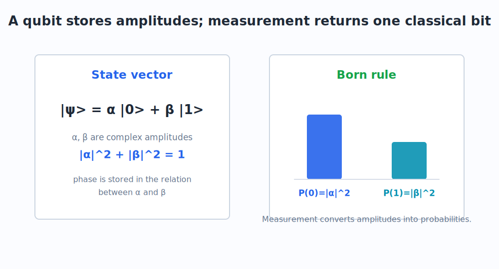
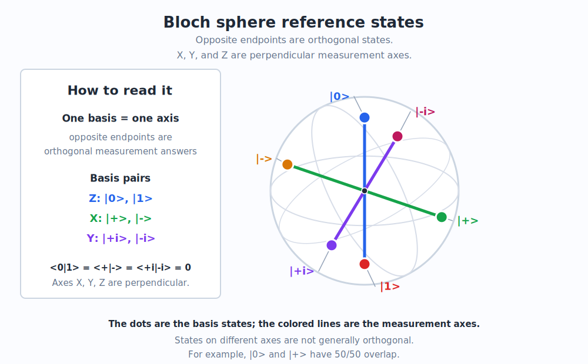
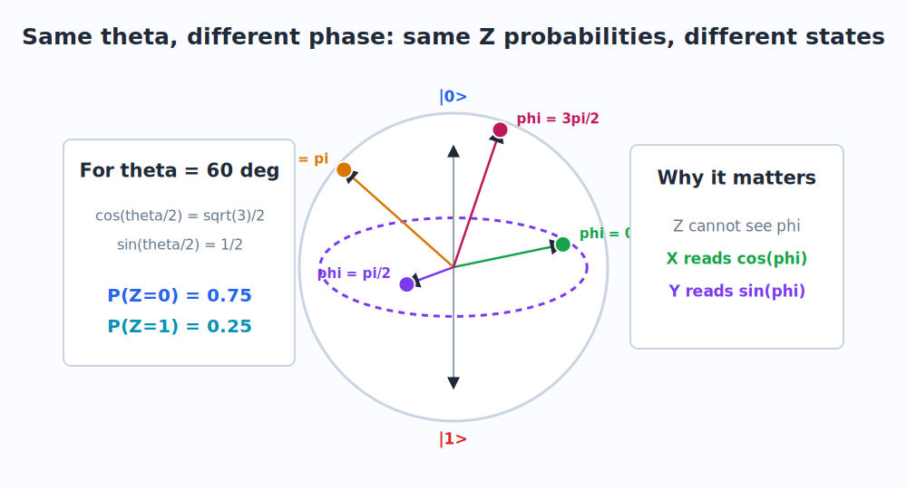

# 4. Qubits and the Bloch Sphere

The qubit is the simplest quantum information unit. It is not merely a bit that is "both 0 and 1." A better engineering definition is:

> A qubit is a two-dimensional quantum state whose coordinates are complex amplitudes.

## 4.1 The Computational Basis

The standard basis states are:

$$
|0\rangle =
\begin{pmatrix}
1 \\
0
\end{pmatrix}
\qquad
|1\rangle =
\begin{pmatrix}
0 \\
1
\end{pmatrix}
$$

These are also called the computational basis or Z basis.

A general pure qubit state is:

$$
|\psi\rangle =
\alpha |0\rangle + \beta |1\rangle
$$

In column-vector form:

$$
|\psi\rangle =
\begin{pmatrix}
\alpha \\
\beta
\end{pmatrix}
$$

The amplitudes $\alpha$ and $\beta$ are complex numbers, and they must satisfy:

$$
|\alpha|^2 + |\beta|^2 = 1
$$

This is the normalization rule from [Section 2.6](02_math_prerequisites.md#26-vectors).

## 4.2 Measurement in the Z Basis

If you measure:

$$
|\psi\rangle =
\alpha |0\rangle + \beta |1\rangle
$$

in the Z basis, the Born rule gives:

$$
P(0) = |\alpha|^2
\qquad
P(1) = |\beta|^2
$$

The device returns one classical bit: 0 or 1.

The important engineering point is that a single measurement does not reveal $\alpha$ and $\beta$. It samples from a distribution. To estimate probabilities experimentally, you prepare and measure many identical copies of the circuit.

## 4.3 Parameterizing a Qubit

Any single-qubit pure state can be written, up to an unobservable global phase, as:

$$
|\psi(\theta,\phi)\rangle =
\cos\frac{\theta}{2}|0\rangle
+
e^{i\phi}\sin\frac{\theta}{2}|1\rangle
$$

This is the most important formula in the chapter.

The angle $\theta$ controls the Z-basis probabilities:

$$
P(0) =
\cos^2\frac{\theta}{2}
\qquad
P(1) =
\sin^2\frac{\theta}{2}
$$

The angle $\phi$ is the relative phase between the $|0\rangle$ and $|1\rangle$ components.

That phase may be invisible in Z measurement, but it affects what happens under later gates or measurements in other bases.

## 4.4 Global Phase versus Relative Phase

**Question.** If phase is so important, is every phase physically meaningful?

**Teacher.** No. A global phase is not observable, but a relative phase is.

If every amplitude is multiplied by the same phase:

$$
|\psi'\rangle =
e^{i\gamma}|\psi\rangle
$$

then all measurement probabilities are unchanged:

$$
|\langle \phi|\psi'\rangle|^2
=
|e^{i\gamma}\langle \phi|\psi\rangle|^2
=
|\langle \phi|\psi\rangle|^2
$$

But the relative phase in:

$$
\alpha |0\rangle + e^{i\phi}\beta |1\rangle
$$

is meaningful, because it changes how the two components recombine.

This is exactly the lesson from [Chapter 3](03_double_slit_and_amplitudes.md): phase matters when amplitudes are added before squaring.

## 4.5 The Reference States

The six most useful single-qubit reference states are:

Z basis:

$$
|0\rangle
\qquad
|1\rangle
$$

X basis:

$$
|+\rangle =
\frac{|0\rangle + |1\rangle}{\sqrt{2}}
\qquad
|-\rangle =
\frac{|0\rangle - |1\rangle}{\sqrt{2}}
$$

Y basis:

$$
|+i\rangle =
\frac{|0\rangle + i|1\rangle}{\sqrt{2}}
\qquad
|-i\rangle =
\frac{|0\rangle - i|1\rangle}{\sqrt{2}}
$$

Pronunciation:

- $|+\rangle$: "ket plus"
- $|-\rangle$: "ket minus"
- $|+i\rangle$: "ket plus i"
- $|-i\rangle$: "ket minus i"

These are not decorative names. They are the eigenstates of the three measurement axes:

- Z axis: $|0\rangle$, $|1\rangle$
- X axis: $|+\rangle$, $|-\rangle$
- Y axis: $|+i\rangle$, $|-i\rangle$

## 4.6 The Bloch Sphere

The Bloch sphere is a geometric picture of a single qubit state.

The state:

$$
|\psi(\theta,\phi)\rangle =
\cos\frac{\theta}{2}|0\rangle
+
e^{i\phi}\sin\frac{\theta}{2}|1\rangle
$$

corresponds to a point on a sphere with coordinates:

$$
r_x = \sin\theta\cos\phi
$$

$$
r_y = \sin\theta\sin\phi
$$

$$
r_z = \cos\theta
$$

The vector:

$$
\vec r = (r_x,r_y,r_z)
$$

is called the Bloch vector.

This formula is the bridge between:

- amplitude notation,
- phase,
- geometric axes,
- measurement probabilities.

## 4.7 Reading the Bloch Sphere

The poles are:

$$
\theta = 0
\quad\Rightarrow\quad
|\psi\rangle = |0\rangle
$$

$$
\theta = \pi
\quad\Rightarrow\quad
|\psi\rangle \sim |1\rangle
$$

The equator contains equal Z-basis probabilities:

$$
P(0) = P(1) = \frac{1}{2}
$$

But different equator points have different phases:

$$
\phi = 0
\quad\Rightarrow\quad
|+\rangle
$$

$$
\phi = \pi
\quad\Rightarrow\quad
|-\rangle
$$

$$
\phi = \frac{\pi}{2}
\quad\Rightarrow\quad
|+i\rangle
$$

$$
\phi = \frac{3\pi}{2}
\quad\Rightarrow\quad
|-i\rangle
$$

So two states can have identical Z-basis probabilities and still be different quantum states.

## 4.8 Same Theta, Different Phi

This was one of the central points in the original conversation.

Take:

$$
\theta = 60^\circ
$$

Then:

$$
\cos\frac{\theta}{2}
=
\cos 30^\circ
=
\frac{\sqrt{3}}{2}
$$

and:

$$
\sin\frac{\theta}{2}
=
\sin 30^\circ
=
\frac{1}{2}
$$

So:

$$
P(0) =
\left(\frac{\sqrt{3}}{2}\right)^2
=
\frac{3}{4}
$$

and:

$$
P(1) =
\left(\frac{1}{2}\right)^2
=
\frac{1}{4}
$$

Those probabilities do not depend on $\phi$.

But the states:

$$
\frac{\sqrt{3}}{2}|0\rangle
+
\frac{1}{2}|1\rangle
$$

$$
\frac{\sqrt{3}}{2}|0\rangle
+
i\frac{1}{2}|1\rangle
$$

$$
\frac{\sqrt{3}}{2}|0\rangle
-
\frac{1}{2}|1\rangle
$$

and:

$$
\frac{\sqrt{3}}{2}|0\rangle
-
i\frac{1}{2}|1\rangle
$$

are different states.

Z measurement cannot distinguish them. X and Y measurements can.

## 4.9 Physical Meaning

**Question.** What does the Bloch sphere mean physically? Is it a real sphere inside the hardware?

**Teacher.** No. It is a state-space picture, not a tiny physical ball.

For a superconducting qubit, $|0\rangle$ and $|1\rangle$ can correspond to two energy levels of an artificial atom. For an ion qubit, they may correspond to two internal states of an ion. For a photon, they may correspond to polarization states.

The Bloch sphere does not say the particle is literally located at a point on a sphere. It says the two-level quantum state has:

- a population imbalance, represented by $r_z$,
- a relative phase, represented by $r_x$ and $r_y$,
- measurement statistics determined by projections onto axes.

This is why the Bloch sphere is so useful for engineers. It turns amplitude algebra into a control picture:

- pulses rotate the state,
- phases move the state around the equator,
- readout extracts a component.

## 4.10 Summary

A qubit state is:

$$
|\psi\rangle =
\alpha|0\rangle + \beta|1\rangle
$$

A useful parameterization is:

$$
|\psi(\theta,\phi)\rangle =
\cos\frac{\theta}{2}|0\rangle
+
e^{i\phi}\sin\frac{\theta}{2}|1\rangle
$$

The Bloch vector is:

$$
\vec r =
(\sin\theta\cos\phi,\sin\theta\sin\phi,\cos\theta)
$$

Z measurement sees $r_z$. X measurement sees $r_x$. Y measurement sees $r_y$. This is the topic of the next chapter.

