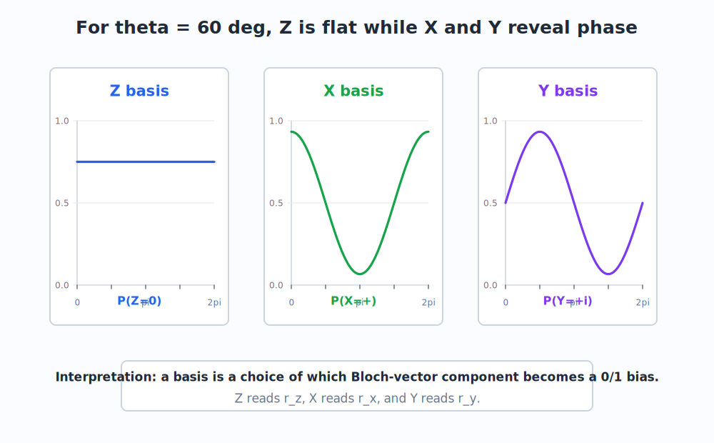
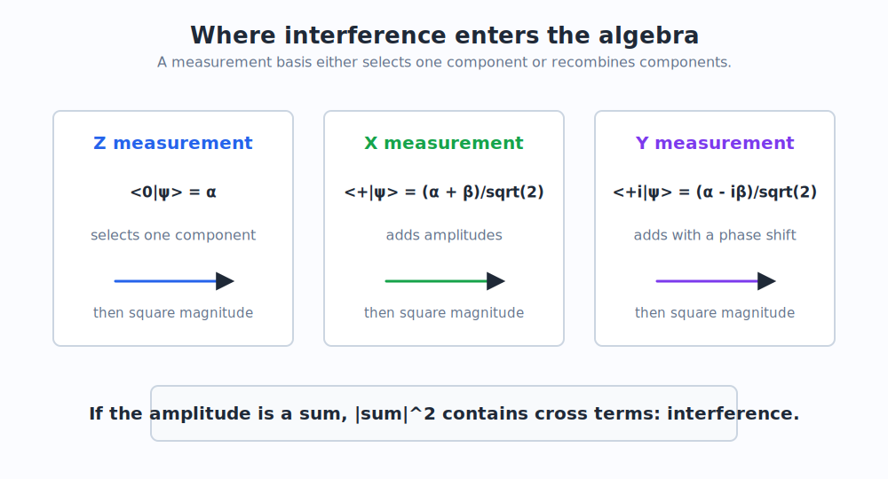

# 5. Measurement Bases

This chapter resolves the central conceptual tension of the conversation:

> Phase can be invisible in one measurement basis and visible in another.

The reason is not mysterious. A measurement basis determines which amplitudes are selected and which amplitudes are recombined before squaring.

## 5.1 What "Measuring in a Basis" Means

**Question.** If real hardware eventually returns 0 or 1, why do people say "measure in X" or "measure in Y"?

**Teacher.** Because the hardware result is classical, but the question you ask the quantum state can be changed before readout.

Measuring in the Z basis means asking:

```math
\{|0\rangle, |1\rangle\}
```

Measuring in the X basis means asking:

```math
\{|+\rangle, |-\rangle\}
```

Measuring in the Y basis means asking:

```math
\{|+i\rangle, |-i\rangle\}
```

The physical detector may still report a bit, but by applying a rotation before measurement, we can make that bit correspond to a different basis.

This is covered operationally in [Circuits and Readout](07_circuits_and_readout.md). Here we focus on the probability formulas.

## 5.2 Measurement as Projection

From [Section 2.8](02_math_prerequisites.md#28-inner-products), the amplitude for observing basis state $|\phi\rangle$ is:

```math
\langle \phi|\psi\rangle
```

The probability is:

```math
P(\phi) =
|\langle \phi|\psi\rangle|^2
```

For Z measurement:

```math
P(0) = |\langle 0|\psi\rangle|^2
\qquad
P(1) = |\langle 1|\psi\rangle|^2
```

For X measurement:

```math
P(+) = |\langle +|\psi\rangle|^2
\qquad
P(-) = |\langle -|\psi\rangle|^2
```

For Y measurement:

```math
P(+i) = |\langle +i|\psi\rangle|^2
\qquad
P(-i) = |\langle -i|\psi\rangle|^2
```

The same state can give different distributions in these bases.

## 5.3 A State with Fixed Theta and Changing Phi

Use the state from the original discussion:

```math
|\psi(\theta,\phi)\rangle =
\cos\frac{\theta}{2}|0\rangle
+
e^{i\phi}\sin\frac{\theta}{2}|1\rangle
```

Set:

```math
\theta = 60^\circ
```

Then:

```math
\cos\frac{\theta}{2}
=
\frac{\sqrt{3}}{2}
\qquad
\sin\frac{\theta}{2}
=
\frac{1}{2}
```

So:

```math
|\psi\rangle =
0.866|0\rangle
+
0.5e^{i\phi}|1\rangle
```

The magnitudes are fixed. Only the relative phase changes.

## 5.4 Bloch-Vector Bridge

The Bloch vector is:

```math
\vec r =
(\sin\theta\cos\phi,\sin\theta\sin\phi,\cos\theta)
```

Write:

```math
\vec r = (r_x,r_y,r_z)
```

For $\theta = 60^\circ$:

```math
\sin\theta =
\frac{\sqrt{3}}{2}
\approx 0.866
```

and:

```math
\cos\theta =
\frac{1}{2}
```

Therefore:

```math
r_z = 0.5
```

```math
r_x = 0.866\cos\phi
```

```math
r_y = 0.866\sin\phi
```

The measurement probabilities are:

```math
P(Z=0) =
\frac{1+r_z}{2}
\qquad
P(Z=1) =
\frac{1-r_z}{2}
```

```math
P(X=+) =
\frac{1+r_x}{2}
\qquad
P(X=-) =
\frac{1-r_x}{2}
```

```math
P(Y=+i) =
\frac{1+r_y}{2}
\qquad
P(Y=-i) =
\frac{1-r_y}{2}
```

This is what "choosing an axis" means mathematically: you choose which component of the Bloch vector becomes the measurement bias.



## 5.5 Z Basis: Phase Is Invisible

In Z measurement:

```math
P(Z=0) =
\frac{1+r_z}{2}
```

For our state:

```math
r_z = 0.5
```

So:

```math
P(Z=0) =
\frac{1+0.5}{2}
=
0.75
```

and:

```math
P(Z=1) =
0.25
```

This does not depend on $\phi$.

Interpretation:

Z measurement reads the magnitudes of the $|0\rangle$ and $|1\rangle$ components. It does not recombine them. Therefore the relative phase between them is not visible.

## 5.6 X Basis: Phase Becomes Cosine

For X measurement:

```math
P(X=+) =
\frac{1+r_x}{2}
```

But:

```math
r_x = \sin\theta\cos\phi
```

For $\theta = 60^\circ$:

```math
P(X=+) =
\frac{1 + 0.866\cos\phi}{2}
```

At $\phi = 0$:

```math
P(X=+) \approx 0.933
```

At $\phi = \pi$:

```math
P(X=+) \approx 0.067
```

This swing is interference.

In algebraic form:

```math
\langle +|\psi\rangle
=
\frac{1}{\sqrt{2}}
\left(
\cos\frac{\theta}{2}
+
e^{i\phi}\sin\frac{\theta}{2}
\right)
```

That is a sum. When you square its magnitude, a cross term appears, and that cross term depends on $\cos\phi$.

## 5.7 Y Basis: Phase Becomes Sine

For Y measurement:

```math
P(Y=+i) =
\frac{1+r_y}{2}
```

But:

```math
r_y = \sin\theta\sin\phi
```

For $\theta = 60^\circ$:

```math
P(Y=+i) =
\frac{1 + 0.866\sin\phi}{2}
```

At $\phi = \frac{\pi}{2}$:

```math
P(Y=+i) \approx 0.933
```

At $\phi = \frac{3\pi}{2}$:

```math
P(Y=+i) \approx 0.067
```

So Y measurement sees the sine component of phase, shifted by 90 degrees relative to X.

## 5.8 Where Interference Hides in the Algebra

This diagram summarizes the key contrast.



In Z measurement, the amplitude for outcome $0$ is:

```math
\langle 0|\psi\rangle = \alpha
```

It selects one component.

In X measurement, the amplitude for outcome $+$ is:

```math
\langle +|\psi\rangle
=
\frac{\alpha + \beta}{\sqrt{2}}
```

It adds components.

In Y measurement, the amplitude for outcome $+i$ is:

```math
\langle +i|\psi\rangle
=
\frac{\alpha - i\beta}{\sqrt{2}}
```

It also adds components, but with a phase shift.

The rule is:

> If the amplitude for a measurement outcome is a sum, then the probability can contain interference.

## 5.9 The Hardware Translation

**Question.** In real devices, do we physically build three different detectors for Z, X, and Y?

**Teacher.** Usually no.

Many platforms have a native readout that is effectively Z-like. For example, a superconducting qubit readout often distinguishes two energy-like states. That is naturally aligned with a computational basis.

To measure X or Y, you rotate the qubit first and then perform the standard Z readout.

Conceptually:

```text
measure X = rotate X information into Z, then measure Z
measure Y = rotate Y information into Z, then measure Z
```

This is why basis changes are not a decorative mathematical trick. They are how real quantum circuits convert hidden phase information into ordinary bits.

## 5.10 Summary

The original confusion is resolved as follows:

- Phase may be invisible in Z measurement because Z selects amplitudes separately.
- Phase becomes visible in X or Y measurement because those bases recombine amplitudes.
- X measurement is sensitive to the cosine component of relative phase.
- Y measurement is sensitive to the sine component of relative phase.
- Real hardware can often use one native readout basis plus rotations to implement other measurement bases.

The next chapter shows those rotations and gates as matrices.

