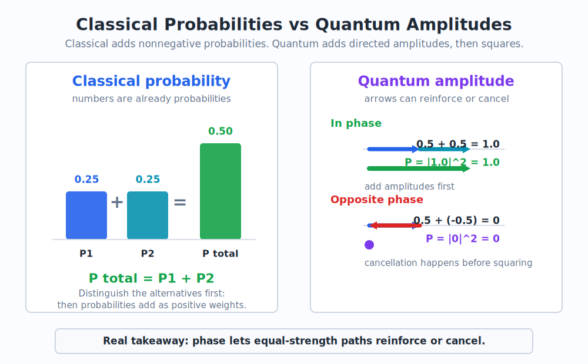
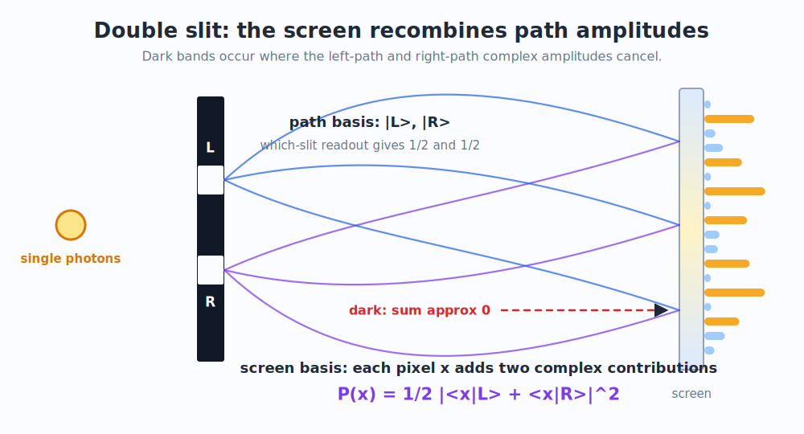
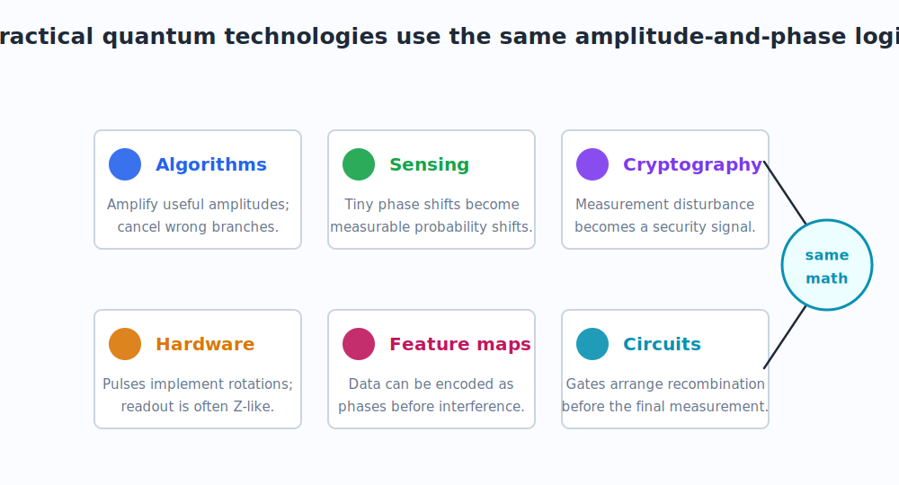
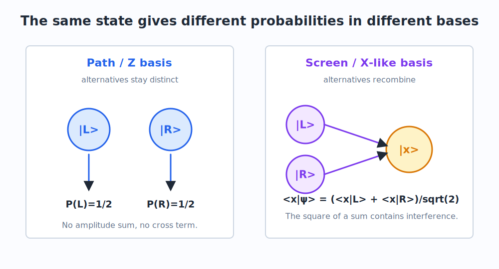
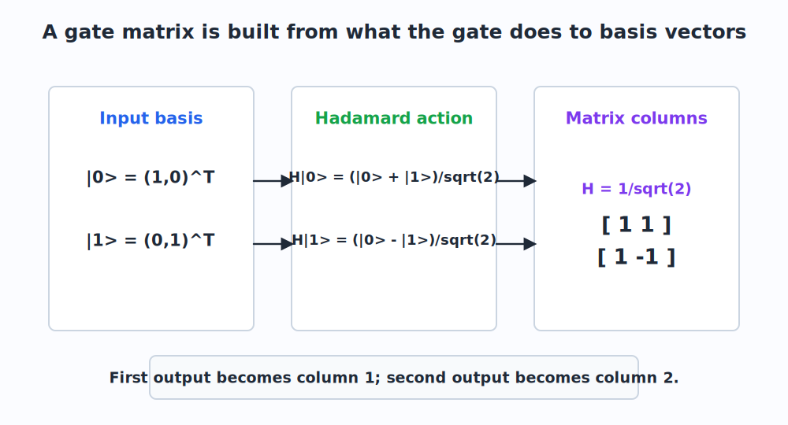
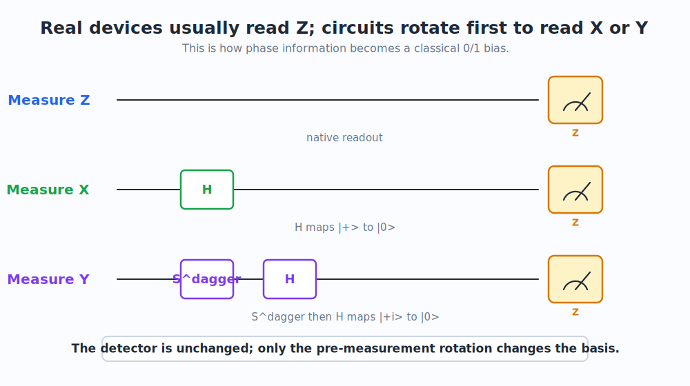

# Quantum Computing for Practical Engineers

## Preface

This book is written for an engineer who wants to understand quantum computing from the inside, not as a list of mystical slogans and not as a pile of formalism detached from physical meaning.

The original learning goal was precise:

> I understand math, but I need a recap of the fundamental concepts, such as complex numbers, cosine, and sine. Start from the physical principles of quantum: interference that can cancel while probabilities do not. Then introduce qubits, transformations, and circuits. I want the math needed to describe quantum, and I want real examples behind the technology and its applicability.

So the book follows that route.

It does not begin with "a qubit is both 0 and 1." That phrase is too loose to be useful. Instead, it begins with the physical fact that quantum systems do not add probabilities first. They add **amplitudes** first. Those amplitudes can have signs and phases. They can reinforce or cancel. Only after measurement do we square magnitudes and obtain probabilities.

That single difference explains why:

- a double-slit experiment has dark fringes,
- a qubit can have an invisible phase,
- a basis change can make that phase visible,
- a quantum circuit is mostly a way of arranging interference before readout,
- real devices often measure only one native basis, then use rotations to expose the information we want.

## How to Read This Book

The chapters are meant to be read in order at least once:

1. [Physical Principles](01_physical_principles.md)
2. [Math and Algebra Prerequisites](02_math_prerequisites.md)
3. [Double Slit and Amplitudes](03_double_slit_and_amplitudes.md)
4. [Qubits and the Bloch Sphere](04_qubits_and_bloch_sphere.md)
5. [Measurement Bases](05_measurement_bases.md)
6. [Gates, Matrices, and Rotations](06_gates_matrices_rotations.md)
7. [Circuits and Readout](07_circuits_and_readout.md)
8. [Practical Examples](08_practical_examples.md)
9. [Worked Labs](09_worked_labs.md)
10. [Glossary](10_glossary.md)

The math chapter is not an appendix to ignore. It is a toolkit. Later chapters refer back to it whenever a concept is reused:

- complex numbers and phases,
- Euler's formula,
- vectors and bases,
- inner products,
- matrices,
- unitary transformations,
- the Born rule.

## The Style of the Book

The book keeps the rhythm of a good tutorial conversation. Many sections begin with a question in the voice of the learner, followed by a teacher's answer. This is deliberate. The goal is not only to state the correct equations, but to resolve the conceptual pressure points that came up in the original discussion:

- If phase does not affect ordinary probability, how can it create interference?
- If all measurements return classical 0/1 bits, why talk about measuring in X or Y?
- If a qubit has the same `P(0)` and `P(1)`, how can it still be a different state?
- How does a ket become a column vector?
- How does a gate become a matrix?
- What does "measurement is choosing an axis" mean physically?

## Reproducible Figures

Every chart and diagram used by the chapters is generated locally.

Run:

```bash
make figures
```

The figure generator uses only the Python standard library and writes SVG files into `figures/`.

To assemble all chapters into one Markdown file:

```bash
make book
```

The assembled output appears at:

```text
dist/quantum-computing-practical-textbook.md
```

## One Sentence Summary

A quantum computer is a programmable interference machine: it stores complex amplitudes, transforms them with unitary operations, and arranges the final measurement so useful amplitude has been reinforced while unwanted amplitude has been cancelled.

# 1. Physical Principles

## 1.1 The Engineer's Starting Point

**Question.** I know how classical systems behave. A bit is 0 or 1. A probability is a positive number. Why does quantum computing need a different language?

**Teacher.** Because the thing that evolves in quantum mechanics is not a probability. It is an amplitude.

In a classical model, if two mutually exclusive ways lead to an event, probabilities add:

$$
P = P_1 + P_2
$$

Since probabilities are nonnegative real numbers, they cannot cancel.

In a quantum model, each alternative contributes a complex amplitude:

$$
\psi = \psi_1 + \psi_2
$$

Only after adding amplitudes do we compute probability:

$$
P = |\psi|^2
$$

That order matters. If

$$
\psi_1 = 1
\qquad
\psi_2 = -1
$$

then

$$
\psi = \psi_1 + \psi_2 = 0
\qquad
P = |\psi|^2 = 0
$$

Two possible contributions produced an impossible outcome.

That is the first structural difference between classical and quantum reasoning.



## 1.2 The Core Rule

Quantum theory has many formalisms, but for this book we begin with the rule that carries most of the intuition:

1. A quantum system has a state.
2. The state contains complex amplitudes.
3. Evolution changes amplitudes smoothly and reversibly, as long as we are not measuring.
4. Measurement converts amplitudes into probabilities.
5. After measurement, the result is classical.

The engineering version is:

> Design transformations so the amplitude of useful outcomes is large and the amplitude of unwanted outcomes is small.

This is why the earlier website phrase "programmable interference machine" is still correct, but it was not enough. To understand it, we must unpack what interference means physically and algebraically.

## 1.3 Probabilities Do Not Interfere; Amplitudes Do

**Question.** If probabilities cannot cancel, but quantum effects can cancel, where is the cancellation hiding?

**Teacher.** It is hiding before probability exists.

The cancellation is not:

$$
P_1 + P_2 = 0
$$

That would be impossible if both probabilities are positive.

The cancellation is:

$$
\psi_1 + \psi_2 = 0
$$

Then probability is computed afterward:

$$
P = |\psi_1 + \psi_2|^2 = 0
$$

This distinction is the key to the rest of the book. Later, in [Math and Algebra Prerequisites](02_math_prerequisites.md), we will make precise what complex amplitudes and magnitudes mean. For now, keep the physical sequence in mind:

```text
alternatives -> amplitudes -> add amplitudes -> square magnitude -> probability
```

## 1.4 The Double-Slit Experiment

The double-slit experiment is the cleanest physical example.

Imagine firing photons or electrons one at a time toward a barrier with two slits, then recording where each particle lands on a screen.

Classically, you might expect:

- some particles go through the left slit,
- some particles go through the right slit,
- the screen pattern is the sum of two single-slit patterns.

Quantum mechanically, with no which-slit measurement, the screen shows interference fringes:

- bright bands where amplitudes reinforce,
- dark bands where amplitudes cancel,
- a statistical pattern built from many single detection events.

The striking point is that each particle is detected as one localized event, but the probability distribution of many such events is shaped by amplitude interference.



## 1.5 What the Double Slit Teaches

The double-slit experiment teaches four lessons that reappear inside quantum computing.

First, a quantum state is not simply ignorance about a classical trajectory. If the particle really had a definite slit path and we merely did not know it, we would add probabilities. But the observed dark fringes require amplitude cancellation.

Second, alternatives can interfere only when they are not distinguished by measurement. If a detector tells us which slit the particle used, the interference pattern disappears. The alternatives become classical alternatives, and probabilities add.

Third, phase matters. The left-path and right-path contributions arrive at a given screen position with phases determined by path length. At some positions the phases line up; at others they are opposite.

Fourth, measurement basis matters. Asking "which slit?" and asking "which screen position?" are different questions. They correspond to different ways of extracting classical information from the same quantum state.

That fourth lesson is the bridge to qubits.

## 1.6 From Double Slit to Qubits

**Question.** What does a double slit have to do with a qubit?

**Teacher.** A two-path system is already qubit-like.

Use two basis states:

$$
|L\rangle = \text{the left path}
\qquad
|R\rangle = \text{the right path}
$$

If the illumination is balanced, the state just after the slits can be approximated by:

$$
|\psi\rangle =
\frac{|L\rangle + |R\rangle}{\sqrt{2}}
$$

That is the same mathematical pattern as a qubit in a superposition:

$$
|\psi\rangle =
\frac{|0\rangle + |1\rangle}{\sqrt{2}}
$$

The labels are different, but the structure is the same: two basis alternatives, each with an amplitude.

This is why the double slit is not just a historical curiosity. It is the physical prototype for the amplitude logic used by qubits and circuits.

## 1.7 The Measurement Problem We Actually Need

For this book, we do not need to solve every philosophical question about quantum measurement. We need the operational rule used by quantum engineering:

Before measurement:

$$
|\psi\rangle = \alpha |0\rangle + \beta |1\rangle
$$

At measurement in the computational basis:

$$
P(0) = |\alpha|^2
\qquad
P(1) = |\beta|^2
$$

After measurement, the device reports one classical result, either 0 or 1.

The phase information that existed in the quantum state is generally destroyed by that readout. That is why useful quantum programs delay measurement until the end, after gates have arranged the amplitudes.

## 1.8 Practical Engineering Relevance

The same physical principle drives multiple quantum technologies.

In quantum algorithms, gates arrange interference so that wrong answers cancel and right answers become more likely. The details differ by algorithm, but the broad mechanism is amplitude steering.

In quantum sensing, a tiny physical effect can change phase. A carefully designed measurement then converts that phase shift into a probability shift. This is why quantum sensors can be extremely sensitive to fields, forces, time, or acceleration.

In quantum cryptography, measurement disturbance matters. If an eavesdropper measures a quantum signal in the wrong basis, the disturbance can be detected statistically.

In quantum machine learning feature maps, classical data may be encoded into phases and rotations. The later circuit then recombines those amplitudes, making phase relationships observable in measurement statistics.



## 1.9 What Comes Next

The physical story gives us the target:

> Understand how amplitudes, phase, basis, and measurement interact.

The next chapter builds the math needed to say that precisely. It covers complex numbers, sine and cosine, Euler's formula, vectors, inner products, matrices, and unitary transformations.

Do not treat that chapter as detached algebra. Every piece will be used again:

- complex numbers explain phase,
- vectors explain states,
- bases explain what a measurement is asking,
- inner products compute amplitudes,
- matrices represent gates,
- unitaries preserve total probability.

# 2. Math and Algebra Prerequisites

This chapter is the mathematical toolkit for the rest of the book. It is deliberately practical. The goal is not abstract elegance for its own sake, but fluency with the objects that quantum mechanics uses every few lines.

The core objects are:

- complex numbers,
- sine and cosine,
- Euler's formula,
- vectors and bases,
- inner products,
- matrices,
- unitary transformations,
- probability from squared magnitude.

Whenever a later chapter says "phase", "basis", "projection", "gate", or "unitary", it is using material from this chapter.

## 2.1 Complex Numbers

**Question.** Why do quantum amplitudes use complex numbers instead of ordinary real numbers?

**Teacher.** Because quantum states need a built-in notion of phase, and phase is naturally represented as rotation in the complex plane.

A complex number has the form:

$$
z = a + ib
$$

where:

$$
i^2 = -1
$$

The number \(a\) is the real part. The number \(b\) is the imaginary part.

The magnitude is:

$$
|z| = \sqrt{a^2 + b^2}
$$

The squared magnitude is:

$$
|z|^2 = a^2 + b^2
$$

Quantum probabilities come from squared magnitudes:

$$
P = |\psi|^2
$$

This is why a complex amplitude can be negative, imaginary, or phase-shifted, while the final probability remains a nonnegative real number.

## 2.2 The Complex Plane

You can picture \(z = a + ib\) as a point or vector:

- horizontal coordinate \(a\),
- vertical coordinate \(b\).

For example:

$$
1 = 1 + 0i
$$

points to the right, while

$$
i = 0 + 1i
$$

points upward.

The number

$$
-1 = -1 + 0i
$$

points left.

This matters because amplitudes can cancel as vectors:

$$
1 + (-1) = 0
$$

They can also cancel after rotating through phases, not only by being literally positive and negative real numbers.

## 2.3 Sine and Cosine as Coordinates

The trigonometric functions \(\cos\theta\) and \(\sin\theta\) are coordinates on the unit circle.

If a point lies on a circle of radius 1 at angle \(\theta\), then:

$$
x = \cos\theta
\qquad
y = \sin\theta
$$

The identity:

$$
\cos^2\theta + \sin^2\theta = 1
$$

is the statement that the point remains on the unit circle.

This identity reappears in qubits. A single-qubit state often uses:

$$
\cos\frac{\theta}{2}
\quad\text{and}\quad
\sin\frac{\theta}{2}
$$

as amplitude magnitudes. The squared magnitudes add to 1:

$$
\cos^2\frac{\theta}{2} + \sin^2\frac{\theta}{2} = 1
$$

That is exactly what we need for probabilities to sum to 1.

## 2.4 Euler's Formula

Euler's formula is the bridge between trigonometry and complex phase:

$$
e^{i\phi} = \cos\phi + i\sin\phi
$$

This says that \(e^{i\phi}\) is a unit-length complex number at angle \(\phi\).

Its magnitude is always 1:

$$
|e^{i\phi}| = 1
$$

So multiplying an amplitude by \(e^{i\phi}\) changes its direction in the complex plane without changing its magnitude.

That is phase.


## 2.5 Why Phase Can Be Invisible

Suppose:

$$
\psi = e^{i\phi}
$$

Then:

$$
|\psi|^2 = |e^{i\phi}|^2 = 1
$$

So if you look only at this one amplitude's magnitude, the phase does not change the probability.

That is the origin of a common phrase:

> Phase does not affect probability.

But that phrase is incomplete. Phase may be invisible when measuring one component directly. It becomes visible when amplitudes are added before squaring.

For example:

$$
\left|\frac{1 + e^{i\phi}}{2}\right|^2
=
\cos^2\frac{\phi}{2}
$$

At \(\phi = 0\), this equals 1. At \(\phi = \pi\), this equals 0.

Same magnitude for the individual phase factor, completely different probability after recombination.

This is the algebraic heart of interference.

## 2.6 Vectors

A vector is an ordered list of numbers. In quantum mechanics, those numbers are often complex.

The computational basis states of a qubit are written:

$$
|0\rangle =
\begin{pmatrix}
1 \\
0
\end{pmatrix}
\qquad
|1\rangle =
\begin{pmatrix}
0 \\
1
\end{pmatrix}
$$

A general qubit is:

$$
|\psi\rangle =
\alpha |0\rangle + \beta |1\rangle
=
\begin{pmatrix}
\alpha \\
\beta
\end{pmatrix}
$$

The coefficients \(\alpha\) and \(\beta\) are complex amplitudes.

The normalization condition is:

$$
|\alpha|^2 + |\beta|^2 = 1
$$

This condition ensures that measurement probabilities sum to 1.

## 2.7 Basis

A basis is a set of reference vectors used to describe a state.

The same vector can be described in different bases, just as the same physical direction in space can be described using north/east coordinates or using rotated axes.

For qubits, the most important bases are:

The Z basis:

$$
|0\rangle
\qquad
|1\rangle
$$

The X basis:

$$
|+\rangle =
\frac{|0\rangle + |1\rangle}{\sqrt{2}}
\qquad
|-\rangle =
\frac{|0\rangle - |1\rangle}{\sqrt{2}}
$$

The Y basis:

$$
|+i\rangle =
\frac{|0\rangle + i|1\rangle}{\sqrt{2}}
\qquad
|-i\rangle =
\frac{|0\rangle - i|1\rangle}{\sqrt{2}}
$$

Read these as:

- "ket plus",
- "ket minus",
- "ket plus i",
- "ket minus i".

These states will become the axes of the Bloch sphere in [Chapter 4](04_qubits_and_bloch_sphere.md), and the measurement bases in [Chapter 5](05_measurement_bases.md).

## 2.8 Inner Products

An inner product measures overlap between vectors.

For complex vectors, the bra corresponding to a ket is the conjugate transpose. If:

$$
|\psi\rangle =
\begin{pmatrix}
\alpha \\
\beta
\end{pmatrix}
$$

then:

$$
\langle \psi| =
\begin{pmatrix}
\alpha^* & \beta^*
\end{pmatrix}
$$

The star means complex conjugate:

$$
(a + ib)^* = a - ib
$$

The amplitude for state \(|\psi\rangle\) to be found in basis state \(|\phi\rangle\) is:

$$
\langle \phi|\psi\rangle
$$

The probability is:

$$
P(\phi) = |\langle \phi|\psi\rangle|^2
$$

This is how we compute measurement probabilities in any basis.

## 2.9 Matrices

A matrix is a linear transformation. A single-qubit gate is represented by a \(2 \times 2\) matrix:

$$
U =
\begin{pmatrix}
a & b \\
c & d
\end{pmatrix}
$$

It acts on a state vector:

$$
U|\psi\rangle
$$

For example, if:

$$
|\psi\rangle =
\begin{pmatrix}
\alpha \\
\beta
\end{pmatrix}
$$

then:

$$
U|\psi\rangle =
\begin{pmatrix}
a\alpha + b\beta \\
c\alpha + d\beta
\end{pmatrix}
$$

Notice the sums. Matrix multiplication is one place where amplitudes naturally recombine.

## 2.10 How a Gate Becomes a Matrix

**Question.** How do we get the actual matrix of a gate from ket notation?

**Teacher.** A linear map is determined by what it does to basis vectors. The images of the basis vectors become the columns of the matrix.

Suppose:

$$
U|0\rangle = a|0\rangle + c|1\rangle
$$

and:

$$
U|1\rangle = b|0\rangle + d|1\rangle
$$

Then:

$$
U =
\begin{pmatrix}
a & b \\
c & d
\end{pmatrix}
$$

The first column is \(U|0\rangle\). The second column is \(U|1\rangle\).

This will be used repeatedly in [Gates, Matrices, and Rotations](06_gates_matrices_rotations.md).

## 2.11 Unitary Matrices

Quantum evolution without measurement is represented by unitary matrices.

A matrix \(U\) is unitary if:

$$
U^\dagger U = I
$$

Here \(U^\dagger\) is the conjugate transpose of \(U\).

The practical meaning is:

> Unitary transformations preserve total probability.

If:

$$
|\alpha|^2 + |\beta|^2 = 1
$$

then after applying a unitary gate:

$$
|\psi'\rangle = U|\psi\rangle
$$

the new amplitudes still satisfy:

$$
|\alpha'|^2 + |\beta'|^2 = 1
$$

That is why ordinary gates are reversible. Measurement is the non-unitary step where a classical outcome is produced.

## 2.12 The Born Rule

The Born rule is the rule that converts quantum amplitude into probability.

If a state is:

$$
|\psi\rangle =
\alpha |0\rangle + \beta |1\rangle
$$

then measurement in the Z basis gives:

$$
P(0) = |\alpha|^2
\qquad
P(1) = |\beta|^2
$$

More generally, if measuring in a basis containing \(|\phi\rangle\):

$$
P(\phi) = |\langle \phi|\psi\rangle|^2
$$

This is the formula that connects all the later examples:

- double slit screen probabilities,
- X-basis measurement,
- Y-basis measurement,
- final circuit readout,
- phase-sensitive sensing.

## 2.13 Summary

Keep this compact map nearby:

| Concept | Formula | Meaning |
|---|---|---|
| Complex number | \(z=a+ib\) | amplitude with direction and magnitude |
| Magnitude | \(\lvert z\rvert=\sqrt{a^2+b^2}\) | length in complex plane |
| Probability | \(P=\lvert\psi\rvert^2\) | squared amplitude magnitude |
| Phase | \(e^{i\phi}\) | unit rotation in complex plane |
| Qubit | \(\lvert\psi\rangle=\alpha\lvert0\rangle+\beta\lvert1\rangle\) | two complex amplitudes |
| Normalization | \(\lvert\alpha\rvert^2+\lvert\beta\rvert^2=1\) | total probability equals 1 |
| Inner product | \(\langle \phi\vert\psi\rangle\) | amplitude of overlap |
| Matrix gate | \(U\lvert\psi\rangle\) | linear transformation of amplitudes |
| Unitary | \(U^\dagger U=I\) | probability-preserving evolution |
# 3. Double Slit and Amplitudes

The double-slit experiment is where the physical and mathematical stories meet.

In [Chapter 1](01_physical_principles.md), we introduced it as a physical fact: particles fired one at a time still build an interference pattern. In [Chapter 2](02_math_prerequisites.md), we introduced complex amplitudes, inner products, and squared magnitudes. Now we combine them.

## 3.1 Two Questions, Two Bases

**Question.** I see why the double slit has interference, but I am confused by this: sometimes phase seems invisible, and sometimes phase changes probabilities. Which is it?

**Teacher.** It depends on what question you ask the system.

In the double slit there are at least two natural questions:

1. Which slit?
2. Which screen position?

These correspond to different measurement bases.

The which-slit basis is:

$$
|L\rangle
\qquad
|R\rangle
$$

The screen-position basis is a set of states:

$$
|x\rangle
$$

where \(x\) labels a detector position on the screen.

The same physical setup can be interrogated in these different ways. The difference is not cosmetic. It changes whether amplitudes are kept separate or recombined.



## 3.2 Which-Slit Measurement

Assume the two slits are equally illuminated. A simple state after the slits is:

$$
|\psi\rangle =
\frac{|L\rangle + |R\rangle}{\sqrt{2}}
$$

If you measure in the which-slit basis, the amplitudes are:

$$
\langle L|\psi\rangle = \frac{1}{\sqrt{2}}
\qquad
\langle R|\psi\rangle = \frac{1}{\sqrt{2}}
$$

By the Born rule from [Section 2.12](02_math_prerequisites.md#212-the-born-rule):

$$
P(L) =
\left|\frac{1}{\sqrt{2}}\right|^2
=
\frac{1}{2}
$$

and:

$$
P(R) =
\left|\frac{1}{\sqrt{2}}\right|^2
=
\frac{1}{2}
$$

There is no interference in this measurement because the alternatives are distinct outcomes. We do not add the left-path amplitude to the right-path amplitude when asking "which slit?"

## 3.3 Screen-Position Measurement

Now ask where the particle lands on the screen.

The amplitude for landing at position \(x\) is:

$$
\langle x|\psi\rangle
=
\frac{1}{\sqrt{2}}
\left(
\langle x|L\rangle
+
\langle x|R\rangle
\right)
$$

This expression is the crucial difference.

The amplitude for outcome \(x\) is a sum of two contributions:

- one contribution from the left slit,
- one contribution from the right slit.

Each contribution is a complex number. In a simplified wave model:

$$
\langle x|L\rangle \propto e^{ikr_L(x)}
$$

and:

$$
\langle x|R\rangle \propto e^{ikr_R(x)}
$$

Here:

- \(k\) is the wave number,
- \(r_L(x)\) is the path length from the left slit to screen position \(x\),
- \(r_R(x)\) is the path length from the right slit to screen position \(x\).

Different path lengths produce different phases.

## 3.4 The Cross Term

The screen probability is:

$$
P(x)
=
|\langle x|\psi\rangle|^2
$$

Substitute the expression above:

$$
P(x)
=
\frac{1}{2}
\left|
\langle x|L\rangle
+
\langle x|R\rangle
\right|^2
$$

Let:

$$
A = \langle x|L\rangle
\qquad
B = \langle x|R\rangle
$$

Then:

$$
|A+B|^2
=
|A|^2 + |B|^2 + 2\operatorname{Re}(A^*B)
$$

The last term is the interference term.

It can be positive, producing a bright band. It can be negative, producing a dark band. At a dark fringe:

$$
A + B \approx 0
$$

so:

$$
P(x) \approx 0
$$

This is not probability cancellation. It is amplitude cancellation before probability is computed.

## 3.5 The Student's Confusion, Made Precise

**Question.** Earlier we said phase does not affect probability because \(|e^{i\phi}|^2 = 1\). But now phase causes dark and bright fringes. How do both statements coexist?

**Teacher.** Phase does not change the squared magnitude of a single isolated unit amplitude. But phase changes the result of a sum.

Compare:

$$
|e^{i\phi}|^2 = 1
$$

No phase dependence.

But:

$$
|1 + e^{i\phi}|^2
$$

does depend on \(\phi\), because the two terms can point in the same or opposite directions in the complex plane.

In fact:

$$
|1 + e^{i\phi}|^2
=
2 + 2\cos\phi
$$

So:

- if \(\phi = 0\), the result is \(4\),
- if \(\phi = \pi\), the result is \(0\).

That is exactly the difference between an isolated amplitude and recombined amplitudes.

## 3.6 The Same Pattern in a Qubit

The double-slit state:

$$
\frac{|L\rangle + |R\rangle}{\sqrt{2}}
$$

has the same structure as:

$$
\frac{|0\rangle + |1\rangle}{\sqrt{2}}
$$

Now insert a relative phase:

$$
|\psi\rangle =
\frac{|0\rangle + e^{i\phi}|1\rangle}{\sqrt{2}}
$$

If we measure in the Z basis \(\{|0\rangle, |1\rangle\}\), the probabilities are:

$$
P(0) = \frac{1}{2}
\qquad
P(1) = \frac{1}{2}
$$

regardless of \(\phi\).

The phase is invisible in that basis.

But if we measure in the X basis:

$$
|+\rangle =
\frac{|0\rangle + |1\rangle}{\sqrt{2}}
\qquad
|-\rangle =
\frac{|0\rangle - |1\rangle}{\sqrt{2}}
$$

then the amplitude for \(+\) is:

$$
\langle +|\psi\rangle
=
\frac{1 + e^{i\phi}}{2}
$$

The probability is:

$$
P(+) =
\left|
\frac{1 + e^{i\phi}}{2}
\right|^2
=
\cos^2\frac{\phi}{2}
$$

At \(\phi = \pi\), this is zero.

That is single-qubit interference.

## 3.7 The Practical Lesson

Quantum computing does not need a literal pair of slits. It needs the same logical structure:

1. Prepare alternatives as amplitudes.
2. Let transformations change their relative phases.
3. Recombine amplitudes with gates.
4. Measure in a basis that reveals the desired interference.

If you skip step 3, phase may remain invisible. If you measure in the wrong basis, you may see flat probabilities even though the state contains useful phase information.

This will be central in [Measurement Bases](05_measurement_bases.md) and [Circuits and Readout](07_circuits_and_readout.md).

## 3.8 A Minimal Numerical Example

Here is the amplitude-only calculation:

```python
import cmath

psi1 = cmath.exp(1j * 0)
psi2 = cmath.exp(1j * cmath.pi)

psi = psi1 + psi2
probability = abs(psi) ** 2

print(psi, probability)
```

The result is:

```text
0j 0.0
```

There were two nonzero contributions. They cancelled because their phases differed by \(\pi\).

## 3.9 Summary

The double slit is the physical template for quantum computation:

- which-path measurement separates alternatives and removes interference,
- screen-position measurement recombines alternatives,
- recombination produces cross terms,
- cross terms can be positive or negative,
- phase becomes visible only through a measurement basis or circuit that recombines amplitudes.

The next chapter introduces the qubit as the simplest engineered system that contains this logic.

# 4. Qubits and the Bloch Sphere

The qubit is the simplest quantum information unit. It is not merely a bit that is "both 0 and 1." A better engineering definition is:

> A qubit is a two-dimensional quantum state whose coordinates are complex amplitudes.

## 4.1 The Computational Basis

The standard basis states are:

$$
|0\rangle =
\begin{pmatrix}
1 \\
0
\end{pmatrix}
\qquad
|1\rangle =
\begin{pmatrix}
0 \\
1
\end{pmatrix}
$$

These are also called the computational basis or Z basis.

A general pure qubit state is:

$$
|\psi\rangle =
\alpha |0\rangle + \beta |1\rangle
$$

In column-vector form:

$$
|\psi\rangle =
\begin{pmatrix}
\alpha \\
\beta
\end{pmatrix}
$$

The amplitudes \(\alpha\) and \(\beta\) are complex numbers, and they must satisfy:

$$
|\alpha|^2 + |\beta|^2 = 1
$$

This is the normalization rule from [Section 2.6](02_math_prerequisites.md#26-vectors).


## 4.2 Measurement in the Z Basis

If you measure:

$$
|\psi\rangle =
\alpha |0\rangle + \beta |1\rangle
$$

in the Z basis, the Born rule gives:

$$
P(0) = |\alpha|^2
\qquad
P(1) = |\beta|^2
$$

The device returns one classical bit: 0 or 1.

The important engineering point is that a single measurement does not reveal \(\alpha\) and \(\beta\). It samples from a distribution. To estimate probabilities experimentally, you prepare and measure many identical copies of the circuit.

## 4.3 Parameterizing a Qubit

Any single-qubit pure state can be written, up to an unobservable global phase, as:

$$
|\psi(\theta,\phi)\rangle =
\cos\frac{\theta}{2}|0\rangle
+
e^{i\phi}\sin\frac{\theta}{2}|1\rangle
$$

This is the most important formula in the chapter.

The angle \(\theta\) controls the Z-basis probabilities:

$$
P(0) =
\cos^2\frac{\theta}{2}
\qquad
P(1) =
\sin^2\frac{\theta}{2}
$$

The angle \(\phi\) is the relative phase between the \(|0\rangle\) and \(|1\rangle\) components.

That phase may be invisible in Z measurement, but it affects what happens under later gates or measurements in other bases.

## 4.4 Global Phase versus Relative Phase

**Question.** If phase is so important, is every phase physically meaningful?

**Teacher.** No. A global phase is not observable, but a relative phase is.

If every amplitude is multiplied by the same phase:

$$
|\psi'\rangle =
e^{i\gamma}|\psi\rangle
$$

then all measurement probabilities are unchanged:

$$
|\langle \phi|\psi'\rangle|^2
=
|e^{i\gamma}\langle \phi|\psi\rangle|^2
=
|\langle \phi|\psi\rangle|^2
$$

But the relative phase in:

$$
\alpha |0\rangle + e^{i\phi}\beta |1\rangle
$$

is meaningful, because it changes how the two components recombine.

This is exactly the lesson from [Chapter 3](03_double_slit_and_amplitudes.md): phase matters when amplitudes are added before squaring.

## 4.5 The Reference States

The six most useful single-qubit reference states are:

Z basis:

$$
|0\rangle
\qquad
|1\rangle
$$

X basis:

$$
|+\rangle =
\frac{|0\rangle + |1\rangle}{\sqrt{2}}
\qquad
|-\rangle =
\frac{|0\rangle - |1\rangle}{\sqrt{2}}
$$

Y basis:

$$
|+i\rangle =
\frac{|0\rangle + i|1\rangle}{\sqrt{2}}
\qquad
|-i\rangle =
\frac{|0\rangle - i|1\rangle}{\sqrt{2}}
$$

Pronunciation:

- \(|+\rangle\): "ket plus"
- \(|-\rangle\): "ket minus"
- \(|+i\rangle\): "ket plus i"
- \(|-i\rangle\): "ket minus i"

These are not decorative names. They are the eigenstates of the three measurement axes:

- Z axis: \(|0\rangle\), \(|1\rangle\)
- X axis: \(|+\rangle\), \(|-\rangle\)
- Y axis: \(|+i\rangle\), \(|-i\rangle\)


## 4.6 The Bloch Sphere

The Bloch sphere is a geometric picture of a single qubit state.

The state:

$$
|\psi(\theta,\phi)\rangle =
\cos\frac{\theta}{2}|0\rangle
+
e^{i\phi}\sin\frac{\theta}{2}|1\rangle
$$

corresponds to a point on a sphere with coordinates:

$$
r_x = \sin\theta\cos\phi
$$

$$
r_y = \sin\theta\sin\phi
$$

$$
r_z = \cos\theta
$$

The vector:

$$
\vec r = (r_x,r_y,r_z)
$$

is called the Bloch vector.

This formula is the bridge between:

- amplitude notation,
- phase,
- geometric axes,
- measurement probabilities.

## 4.7 Reading the Bloch Sphere

The poles are:

$$
\theta = 0
\quad\Rightarrow\quad
|\psi\rangle = |0\rangle
$$

$$
\theta = \pi
\quad\Rightarrow\quad
|\psi\rangle \sim |1\rangle
$$

The equator contains equal Z-basis probabilities:

$$
P(0) = P(1) = \frac{1}{2}
$$

But different equator points have different phases:

$$
\phi = 0
\quad\Rightarrow\quad
|+\rangle
$$

$$
\phi = \pi
\quad\Rightarrow\quad
|-\rangle
$$

$$
\phi = \frac{\pi}{2}
\quad\Rightarrow\quad
|+i\rangle
$$

$$
\phi = \frac{3\pi}{2}
\quad\Rightarrow\quad
|-i\rangle
$$

So two states can have identical Z-basis probabilities and still be different quantum states.

## 4.8 Same Theta, Different Phi

This was one of the central points in the original conversation.

Take:

$$
\theta = 60^\circ
$$

Then:

$$
\cos\frac{\theta}{2}
=
\cos 30^\circ
=
\frac{\sqrt{3}}{2}
$$

and:

$$
\sin\frac{\theta}{2}
=
\sin 30^\circ
=
\frac{1}{2}
$$

So:

$$
P(0) =
\left(\frac{\sqrt{3}}{2}\right)^2
=
\frac{3}{4}
$$

and:

$$
P(1) =
\left(\frac{1}{2}\right)^2
=
\frac{1}{4}
$$

Those probabilities do not depend on \(\phi\).

But the states:

$$
\frac{\sqrt{3}}{2}|0\rangle
+
\frac{1}{2}|1\rangle
$$

$$
\frac{\sqrt{3}}{2}|0\rangle
+
i\frac{1}{2}|1\rangle
$$

$$
\frac{\sqrt{3}}{2}|0\rangle
-
\frac{1}{2}|1\rangle
$$

and:

$$
\frac{\sqrt{3}}{2}|0\rangle
-
i\frac{1}{2}|1\rangle
$$

are different states.

Z measurement cannot distinguish them. X and Y measurements can.


## 4.9 Physical Meaning

**Question.** What does the Bloch sphere mean physically? Is it a real sphere inside the hardware?

**Teacher.** No. It is a state-space picture, not a tiny physical ball.

For a superconducting qubit, \(|0\rangle\) and \(|1\rangle\) can correspond to two energy levels of an artificial atom. For an ion qubit, they may correspond to two internal states of an ion. For a photon, they may correspond to polarization states.

The Bloch sphere does not say the particle is literally located at a point on a sphere. It says the two-level quantum state has:

- a population imbalance, represented by \(r_z\),
- a relative phase, represented by \(r_x\) and \(r_y\),
- measurement statistics determined by projections onto axes.

This is why the Bloch sphere is so useful for engineers. It turns amplitude algebra into a control picture:

- pulses rotate the state,
- phases move the state around the equator,
- readout extracts a component.

## 4.10 Summary

A qubit state is:

$$
|\psi\rangle =
\alpha|0\rangle + \beta|1\rangle
$$

A useful parameterization is:

$$
|\psi(\theta,\phi)\rangle =
\cos\frac{\theta}{2}|0\rangle
+
e^{i\phi}\sin\frac{\theta}{2}|1\rangle
$$

The Bloch vector is:

$$
\vec r =
(\sin\theta\cos\phi,\sin\theta\sin\phi,\cos\theta)
$$

Z measurement sees \(r_z\). X measurement sees \(r_x\). Y measurement sees \(r_y\). This is the topic of the next chapter.

# 5. Measurement Bases

This chapter resolves the central conceptual tension of the conversation:

> Phase can be invisible in one measurement basis and visible in another.

The reason is not mysterious. A measurement basis determines which amplitudes are selected and which amplitudes are recombined before squaring.

## 5.1 What "Measuring in a Basis" Means

**Question.** If real hardware eventually returns 0 or 1, why do people say "measure in X" or "measure in Y"?

**Teacher.** Because the hardware result is classical, but the question you ask the quantum state can be changed before readout.

Measuring in the Z basis means asking:

$$
\{|0\rangle, |1\rangle\}
$$

Measuring in the X basis means asking:

$$
\{|+\rangle, |-\rangle\}
$$

Measuring in the Y basis means asking:

$$
\{|+i\rangle, |-i\rangle\}
$$

The physical detector may still report a bit, but by applying a rotation before measurement, we can make that bit correspond to a different basis.

This is covered operationally in [Circuits and Readout](07_circuits_and_readout.md). Here we focus on the probability formulas.

## 5.2 Measurement as Projection

From [Section 2.8](02_math_prerequisites.md#28-inner-products), the amplitude for observing basis state \(|\phi\rangle\) is:

$$
\langle \phi|\psi\rangle
$$

The probability is:

$$
P(\phi) =
|\langle \phi|\psi\rangle|^2
$$

For Z measurement:

$$
P(0) = |\langle 0|\psi\rangle|^2
\qquad
P(1) = |\langle 1|\psi\rangle|^2
$$

For X measurement:

$$
P(+) = |\langle +|\psi\rangle|^2
\qquad
P(-) = |\langle -|\psi\rangle|^2
$$

For Y measurement:

$$
P(+i) = |\langle +i|\psi\rangle|^2
\qquad
P(-i) = |\langle -i|\psi\rangle|^2
$$

The same state can give different distributions in these bases.

## 5.3 A State with Fixed Theta and Changing Phi

Use the state from the original discussion:

$$
|\psi(\theta,\phi)\rangle =
\cos\frac{\theta}{2}|0\rangle
+
e^{i\phi}\sin\frac{\theta}{2}|1\rangle
$$

Set:

$$
\theta = 60^\circ
$$

Then:

$$
\cos\frac{\theta}{2}
=
\frac{\sqrt{3}}{2}
\qquad
\sin\frac{\theta}{2}
=
\frac{1}{2}
$$

So:

$$
|\psi\rangle =
0.866|0\rangle
+
0.5e^{i\phi}|1\rangle
$$

The magnitudes are fixed. Only the relative phase changes.

## 5.4 Bloch-Vector Bridge

The Bloch vector is:

$$
\vec r =
(\sin\theta\cos\phi,\sin\theta\sin\phi,\cos\theta)
$$

Write:

$$
\vec r = (r_x,r_y,r_z)
$$

For \(\theta = 60^\circ\):

$$
\sin\theta =
\frac{\sqrt{3}}{2}
\approx 0.866
$$

and:

$$
\cos\theta =
\frac{1}{2}
$$

Therefore:

$$
r_z = 0.5
$$

$$
r_x = 0.866\cos\phi
$$

$$
r_y = 0.866\sin\phi
$$

The measurement probabilities are:

$$
P(Z=0) =
\frac{1+r_z}{2}
\qquad
P(Z=1) =
\frac{1-r_z}{2}
$$

$$
P(X=+) =
\frac{1+r_x}{2}
\qquad
P(X=-) =
\frac{1-r_x}{2}
$$

$$
P(Y=+i) =
\frac{1+r_y}{2}
\qquad
P(Y=-i) =
\frac{1-r_y}{2}
$$

This is what "choosing an axis" means mathematically: you choose which component of the Bloch vector becomes the measurement bias.


## 5.5 Z Basis: Phase Is Invisible

In Z measurement:

$$
P(Z=0) =
\frac{1+r_z}{2}
$$

For our state:

$$
r_z = 0.5
$$

So:

$$
P(Z=0) =
\frac{1+0.5}{2}
=
0.75
$$

and:

$$
P(Z=1) =
0.25
$$

This does not depend on \(\phi\).

Interpretation:

Z measurement reads the magnitudes of the \(|0\rangle\) and \(|1\rangle\) components. It does not recombine them. Therefore the relative phase between them is not visible.

## 5.6 X Basis: Phase Becomes Cosine

For X measurement:

$$
P(X=+) =
\frac{1+r_x}{2}
$$

But:

$$
r_x = \sin\theta\cos\phi
$$

For \(\theta = 60^\circ\):

$$
P(X=+) =
\frac{1 + 0.866\cos\phi}{2}
$$

At \(\phi = 0\):

$$
P(X=+) \approx 0.933
$$

At \(\phi = \pi\):

$$
P(X=+) \approx 0.067
$$

This swing is interference.

In algebraic form:

$$
\langle +|\psi\rangle
=
\frac{1}{\sqrt{2}}
\left(
\cos\frac{\theta}{2}
+
e^{i\phi}\sin\frac{\theta}{2}
\right)
$$

That is a sum. When you square its magnitude, a cross term appears, and that cross term depends on \(\cos\phi\).

## 5.7 Y Basis: Phase Becomes Sine

For Y measurement:

$$
P(Y=+i) =
\frac{1+r_y}{2}
$$

But:

$$
r_y = \sin\theta\sin\phi
$$

For \(\theta = 60^\circ\):

$$
P(Y=+i) =
\frac{1 + 0.866\sin\phi}{2}
$$

At \(\phi = \frac{\pi}{2}\):

$$
P(Y=+i) \approx 0.933
$$

At \(\phi = \frac{3\pi}{2}\):

$$
P(Y=+i) \approx 0.067
$$

So Y measurement sees the sine component of phase, shifted by 90 degrees relative to X.

## 5.8 Where Interference Hides in the Algebra

This diagram summarizes the key contrast.


In Z measurement, the amplitude for outcome \(0\) is:

$$
\langle 0|\psi\rangle = \alpha
$$

It selects one component.

In X measurement, the amplitude for outcome \(+\) is:

$$
\langle +|\psi\rangle
=
\frac{\alpha + \beta}{\sqrt{2}}
$$

It adds components.

In Y measurement, the amplitude for outcome \(+i\) is:

$$
\langle +i|\psi\rangle
=
\frac{\alpha - i\beta}{\sqrt{2}}
$$

It also adds components, but with a phase shift.

The rule is:

> If the amplitude for a measurement outcome is a sum, then the probability can contain interference.

## 5.9 The Hardware Translation

**Question.** In real devices, do we physically build three different detectors for Z, X, and Y?

**Teacher.** Usually no.

Many platforms have a native readout that is effectively Z-like. For example, a superconducting qubit readout often distinguishes two energy-like states. That is naturally aligned with a computational basis.

To measure X or Y, you rotate the qubit first and then perform the standard Z readout.

Conceptually:

```text
measure X = rotate X information into Z, then measure Z
measure Y = rotate Y information into Z, then measure Z
```

This is why basis changes are not a decorative mathematical trick. They are how real quantum circuits convert hidden phase information into ordinary bits.

## 5.10 Summary

The original confusion is resolved as follows:

- Phase may be invisible in Z measurement because Z selects amplitudes separately.
- Phase becomes visible in X or Y measurement because those bases recombine amplitudes.
- X measurement is sensitive to the cosine component of relative phase.
- Y measurement is sensitive to the sine component of relative phase.
- Real hardware can often use one native readout basis plus rotations to implement other measurement bases.

The next chapter shows those rotations and gates as matrices.

# 6. Gates, Matrices, and Rotations

Quantum gates are transformations of amplitudes. For a single qubit, a gate is a \(2 \times 2\) unitary matrix. On the Bloch sphere, many gates can be understood as rotations.

This chapter connects three languages:

- ket notation,
- matrices,
- geometric rotations.

## 6.1 A Gate Is a Linear Map

From [Section 2.9](02_math_prerequisites.md#29-matrices), a matrix acts on a vector by linear combination.

For a qubit:

$$
|\psi\rangle =
\alpha|0\rangle + \beta|1\rangle
=
\begin{pmatrix}
\alpha \\
\beta
\end{pmatrix}
$$

A gate \(U\) produces:

$$
|\psi'\rangle = U|\psi\rangle
$$

Because \(U\) is linear:

$$
U(\alpha|0\rangle + \beta|1\rangle)
=
\alpha U|0\rangle + \beta U|1\rangle
$$

That is why knowing what a gate does to \(|0\rangle\) and \(|1\rangle\) determines the whole gate.

## 6.2 Building the Matrix from Columns

**Question.** How does a ket rule become a matrix?

**Teacher.** The output of the first basis vector becomes the first column. The output of the second basis vector becomes the second column.

Suppose:

$$
U|0\rangle = a|0\rangle + c|1\rangle
$$

and:

$$
U|1\rangle = b|0\rangle + d|1\rangle
$$

Then:

$$
U =
\begin{pmatrix}
a & b \\
c & d
\end{pmatrix}
$$



## 6.3 The Hadamard Gate

The Hadamard gate is:

$$
H =
\frac{1}{\sqrt{2}}
\begin{pmatrix}
1 & 1 \\
1 & -1
\end{pmatrix}
$$

It acts on the computational basis as:

$$
H|0\rangle =
\frac{|0\rangle + |1\rangle}{\sqrt{2}}
=
|+\rangle
$$

and:

$$
H|1\rangle =
\frac{|0\rangle - |1\rangle}{\sqrt{2}}
=
|-\rangle
$$

It also maps back:

$$
H|+\rangle = |0\rangle
\qquad
H|-\rangle = |1\rangle
$$

This is why applying \(H\) before Z readout implements X-basis measurement.

## 6.4 Hadamard as Recombination

Hadamard is one of the clearest gates for seeing interference.

Apply \(H\) to:

$$
|\psi\rangle =
\alpha|0\rangle + \beta|1\rangle
$$

Using matrix multiplication:

$$
H|\psi\rangle =
\frac{1}{\sqrt{2}}
\begin{pmatrix}
1 & 1 \\
1 & -1
\end{pmatrix}
\begin{pmatrix}
\alpha \\
\beta
\end{pmatrix}
=
\frac{1}{\sqrt{2}}
\begin{pmatrix}
\alpha + \beta \\
\alpha - \beta
\end{pmatrix}
$$

The new \(|0\rangle\) amplitude is:

$$
\frac{\alpha+\beta}{\sqrt{2}}
$$

The new \(|1\rangle\) amplitude is:

$$
\frac{\alpha-\beta}{\sqrt{2}}
$$

So \(H\) explicitly creates sums and differences of amplitudes. It is a recombination gate.

If \(\alpha = 1/\sqrt{2}\) and \(\beta = -1/\sqrt{2}\), then:

$$
\alpha+\beta = 0
$$

and the \(|0\rangle\) output disappears.

## 6.5 Pauli Gates

The Pauli gates are:

$$
X =
\begin{pmatrix}
0 & 1 \\
1 & 0
\end{pmatrix}
$$

$$
Y =
\begin{pmatrix}
0 & -i \\
i & 0
\end{pmatrix}
$$

$$
Z =
\begin{pmatrix}
1 & 0 \\
0 & -1
\end{pmatrix}
$$

Their basic actions are:

$$
X|0\rangle = |1\rangle
\qquad
X|1\rangle = |0\rangle
$$

So \(X\) is the quantum analogue of a bit flip.

The \(Z\) gate leaves \(|0\rangle\) unchanged and flips the sign of \(|1\rangle\):

$$
Z(\alpha|0\rangle + \beta|1\rangle)
=
\alpha|0\rangle - \beta|1\rangle
$$

This is a phase flip. It does not change Z-basis probabilities, but it changes future interference.

The \(Y\) gate combines bit flip and phase factors.

## 6.6 The Phase Gate S

The \(S\) gate is:

$$
S =
\begin{pmatrix}
1 & 0 \\
0 & i
\end{pmatrix}
$$

It acts as:

$$
S(\alpha|0\rangle + \beta|1\rangle)
=
\alpha|0\rangle + i\beta|1\rangle
$$

It adds a relative phase of \(\pi/2\) to the \(|1\rangle\) component.

Its inverse is:

$$
S^\dagger =
\begin{pmatrix}
1 & 0 \\
0 & -i
\end{pmatrix}
$$

The \(S^\dagger\) gate is used when converting Y-basis information into Z-basis readout.

## 6.7 Rotation Gates

Single-qubit rotations are usually written:

$$
R_x(\theta) =
e^{-i\theta X/2}
$$

$$
R_y(\theta) =
e^{-i\theta Y/2}
$$

$$
R_z(\theta) =
e^{-i\theta Z/2}
$$

Their matrices are:

$$
R_x(\theta)
=
\begin{pmatrix}
\cos(\theta/2) & -i\sin(\theta/2) \\
-i\sin(\theta/2) & \cos(\theta/2)
\end{pmatrix}
$$

$$
R_y(\theta)
=
\begin{pmatrix}
\cos(\theta/2) & -\sin(\theta/2) \\
\sin(\theta/2) & \cos(\theta/2)
\end{pmatrix}
$$

$$
R_z(\theta)
=
\begin{pmatrix}
e^{-i\theta/2} & 0 \\
0 & e^{i\theta/2}
\end{pmatrix}
$$

These gates rotate the Bloch vector around the X, Y, and Z axes.

## 6.8 Rotations Have Physical Meaning

**Question.** Are these rotations just math, or do they correspond to real hardware controls?

**Teacher.** They correspond to real controls.

In many quantum devices, gates are implemented by applying controlled pulses. The pulse amplitude, duration, phase, and frequency determine the rotation axis and angle in the qubit's state space.

For example:

- a pulse resonant with a superconducting qubit transition can rotate the state around an equatorial axis,
- the phase of the microwave drive changes the rotation axis in the X-Y plane,
- virtual Z rotations can often be implemented by updating a phase reference rather than physically pulsing the qubit.

The Bloch sphere is therefore not just a teaching picture. It is also a control picture.

## 6.9 Unitarity and Probability Conservation

Every ideal gate above is unitary:

$$
U^\dagger U = I
$$

This means:

$$
\|U|\psi\rangle\|^2 =
\||\psi\rangle\|^2
$$

In ordinary language:

> Gates move probability amplitude around, but they do not create or destroy total probability.

Measurement is different. Measurement produces a classical outcome and changes the state in a non-unitary way.

## 6.10 Why Gates Matter for Interference

The double-slit experiment has physical paths and a screen that recombines them.

A quantum circuit has basis states and gates that recombine amplitudes.

The Hadamard gate is the simplest example:

$$
\begin{pmatrix}
\alpha \\
\beta
\end{pmatrix}
\mapsto
\frac{1}{\sqrt{2}}
\begin{pmatrix}
\alpha+\beta \\
\alpha-\beta
\end{pmatrix}
$$

If the phases line up, one output is reinforced. If they oppose, one output is cancelled.

This is the practical circuit version of interference.

## 6.11 Summary

The chapter's key points:

- a gate is a linear map on amplitudes,
- its matrix columns are the images of basis states,
- Hadamard recombines amplitudes by sums and differences,
- Pauli and phase gates manipulate bit value and phase,
- rotation gates implement controlled movement on the Bloch sphere,
- ideal gates are unitary and preserve total probability,
- real hardware gates correspond to physical controls such as pulses and phase references.

Next we put these gates into circuits and connect them to final 0/1 readout.

# 7. Circuits and Readout

A quantum circuit is a sequence of operations applied to quantum states, followed by measurement. The useful part of the circuit usually happens before measurement, while amplitudes are still free to interfere.

This chapter connects the earlier ideas:

- amplitudes,
- basis changes,
- gates,
- rotations,
- final readout.

## 7.1 The Circuit Pattern

Most introductory single-qubit circuits follow this structure:

```text
prepare -> transform -> maybe change basis -> measure
```

In equations:

$$
|\psi_{\text{out}}\rangle =
U_n \cdots U_2 U_1 |\psi_{\text{in}}\rangle
$$

Then measurement converts the final amplitudes into classical outcome probabilities.

The order matters. Measurement too early destroys the phase relationships that later gates would have used.

## 7.2 Native Z Readout

Many real devices naturally measure something equivalent to the Z basis:

$$
\{|0\rangle, |1\rangle\}
$$

This gives:

$$
P(0) = |\alpha|^2
\qquad
P(1) = |\beta|^2
$$

But a state can contain information in phase, which Z readout may not see.

So the practical strategy is:

> Rotate the state so the desired information becomes Z-basis population, then perform native readout.



## 7.3 Measuring X Using H Then Z

The X basis is:

$$
|+\rangle =
\frac{|0\rangle + |1\rangle}{\sqrt{2}}
\qquad
|-\rangle =
\frac{|0\rangle - |1\rangle}{\sqrt{2}}
$$

Hadamard maps:

$$
H|+\rangle = |0\rangle
\qquad
H|-\rangle = |1\rangle
$$

Therefore, to measure in X:

1. Apply \(H\).
2. Measure in Z.

The probability of observing 0 after the \(H\) gate equals the original probability of \(X=+\).

This is not a trick. It is how a circuit asks the X-basis question using a Z-basis detector.

## 7.4 Measuring Y Using \(S^\dagger\), H, Then Z

The Y basis is:

$$
|+i\rangle =
\frac{|0\rangle + i|1\rangle}{\sqrt{2}}
\qquad
|-i\rangle =
\frac{|0\rangle - i|1\rangle}{\sqrt{2}}
$$

To measure in Y, one common circuit is:

1. Apply \(S^\dagger\).
2. Apply \(H\).
3. Measure in Z.

The \(S^\dagger\) removes the \(i\)-phase relationship, and \(H\) converts the resulting X-like basis into Z readout.

Operationally:

```text
Y basis -> S dagger -> X basis -> H -> Z basis
```

## 7.5 Why Final Rotations Reveal Phase

**Question.** If the hardware always gives 0 or 1, what is the point of saying phase was measured?

**Teacher.** Phase is not read directly as a label on the screen. It is converted into a probability bias.

For:

$$
|\psi\rangle =
\frac{|0\rangle + e^{i\phi}|1\rangle}{\sqrt{2}}
$$

Z measurement gives:

$$
P(0) = P(1) = \frac{1}{2}
$$

No phase dependence.

Apply \(H\) first:

$$
H|\psi\rangle =
\frac{1}{2}
\left[
(1+e^{i\phi})|0\rangle
+
(1-e^{i\phi})|1\rangle
\right]
$$

Now:

$$
P(0) =
\left|
\frac{1+e^{i\phi}}{2}
\right|^2
=
\cos^2\frac{\phi}{2}
$$

The final bit still says 0 or 1. But the frequency of 0 across many repetitions depends on the phase.

That is the circuit version of the double-slit screen.

## 7.6 Shots and Statistics

A quantum measurement is sampled. A single run gives one outcome. To estimate probabilities, repeat the same circuit many times.

Each repetition is often called a shot.

If the true probability is:

$$
P(0) = 0.75
$$

then 1000 shots might produce approximately:

```text
0: 750 counts
1: 250 counts
```

with statistical fluctuation.

This is why quantum programming outputs histograms and expectation values, not hidden amplitudes directly.

## 7.7 Expectation Values

For a single qubit, the expectation values of Pauli observables are connected to the Bloch vector:

$$
\langle Z\rangle = r_z
$$

$$
\langle X\rangle = r_x
$$

$$
\langle Y\rangle = r_y
$$

The measurement probabilities are:

$$
P(Z=0)=\frac{1+\langle Z\rangle}{2}
\qquad
P(Z=1)=\frac{1-\langle Z\rangle}{2}
$$

Similarly:

$$
P(X=+)=\frac{1+\langle X\rangle}{2}
$$

and:

$$
P(Y=+i)=\frac{1+\langle Y\rangle}{2}
$$

This is why measuring along different axes reconstructs different components of the state.

## 7.8 A Minimal Interference Circuit

Start with:

$$
|0\rangle
$$

Apply \(H\):

$$
H|0\rangle =
\frac{|0\rangle + |1\rangle}{\sqrt{2}}
=
|+\rangle
$$

Apply \(Z\):

$$
Z|+\rangle =
\frac{|0\rangle - |1\rangle}{\sqrt{2}}
=
|-\rangle
$$

Apply \(H\) again:

$$
H|-\rangle = |1\rangle
$$

So the circuit:

```text
|0> -- H -- Z -- H -- measure
```

returns 1 with probability 1.

But if the middle \(Z\) were absent:

```text
|0> -- H -- H -- measure
```

then:

$$
H H |0\rangle = |0\rangle
$$

so the circuit returns 0 with probability 1.

The only difference is a phase flip in the middle. That phase flip becomes a deterministic output change after recombination by the final \(H\).

This is a small quantum algorithm in miniature.

## 7.9 Circuit as an Interferometer

The circuit:

```text
H -> phase -> H -> measurement
```

is analogous to an interferometer:

1. First \(H\): split amplitude into alternatives.
2. Phase operation: change the relative phase.
3. Second \(H\): recombine alternatives.
4. Measurement: sample the result.

The double slit has physical paths. The circuit has basis-state paths. The mathematics is the same: relative phase becomes observable only after recombination.

## 7.10 Practical Readout in Real Hardware

In superconducting devices, readout can be implemented by coupling the qubit to a resonator. The resonator response depends on the qubit state, and classical electronics infer whether the qubit was closer to \(|0\rangle\) or \(|1\rangle\).

In trapped-ion devices, state-dependent fluorescence can distinguish internal states.

In photonic devices, detectors count photons in output modes or polarizations.

The details differ, but the operational pattern is shared:

```text
quantum amplitudes -> controlled transformations -> measurement statistics
```

## 7.11 Summary

Key points:

- circuits transform amplitudes before measurement,
- many devices naturally perform Z-like readout,
- measuring X or Y can be implemented by rotating first,
- phase becomes a classical probability bias only after recombination,
- repeated shots estimate probabilities,
- a simple \(H\)-phase-\(H\) circuit is the circuit analogue of an interferometer.

# 8. Practical Examples

The conversation asked for practical perspective, not only formal quantum mechanics. This chapter connects the same amplitude-and-phase ideas to real technology.

The goal is not to survey every quantum technology. The goal is to show how the book's core ideas reappear in practical settings.

## 8.1 The Common Pattern

Across quantum computing, sensing, cryptography, and feature-map style quantum machine learning, the recurring pattern is:

```text
prepare a state
encode information into amplitude or phase
transform/recombine amplitudes
measure statistics
interpret the classical results
```

The physical platform changes. The logic remains.


## 8.2 Quantum Algorithms as Engineered Interference

**Question.** When people say a quantum algorithm uses interference, what do they mean concretely?

**Teacher.** They mean the circuit is arranged so that amplitudes leading to useful outputs add constructively, while amplitudes leading to unwanted outputs cancel or become small.

At a high level:

1. Prepare a superposition.
2. Apply operations that encode the problem into phases or signs.
3. Recombine amplitudes with gates.
4. Measure.

The final measurement is still classical. The quantum advantage, when present, comes from how the amplitudes were transformed before that measurement.

The single-qubit circuit:

```text
H -> phase -> H -> measure
```

is the smallest model of this idea. The first \(H\) creates alternatives. The phase operation changes the relative phase. The final \(H\) recombines alternatives so phase becomes a measurable bias.

Larger algorithms use higher-dimensional versions of the same idea.

## 8.3 Quantum Sensing

Quantum sensing is often the most physically intuitive application of phase.

Imagine a qubit prepared in an equal superposition:

$$
|+\rangle =
\frac{|0\rangle + |1\rangle}{\sqrt{2}}
$$

Suppose the environment causes the \(|1\rangle\) component to acquire a phase:

$$
|\psi\rangle =
\frac{|0\rangle + e^{i\phi}|1\rangle}{\sqrt{2}}
$$

The phase \(\phi\) may depend on a magnetic field, electric field, acceleration, time, or another physical quantity.

Z measurement alone gives:

$$
P(0)=P(1)=\frac{1}{2}
$$

But applying \(H\) before measurement gives:

$$
P(0)=\cos^2\frac{\phi}{2}
$$

So a tiny physical phase shift becomes a measurable change in output frequency.

This is the same structure as [Section 7.5](07_circuits_and_readout.md#75-why-final-rotations-reveal-phase).

## 8.4 Ramsey Interferometry as a Qubit Example

Ramsey interferometry is a standard phase-measurement pattern:

```text
prepare |0>
apply pi/2 pulse
wait while phase accumulates
apply pi/2 pulse
measure
```

In quantum-circuit language, it resembles:

```text
|0> -- H -- phase accumulation -- H -- measure
```

The waiting period lets the qubit acquire a phase relative to the control reference. The second pulse converts that phase into a population difference.

This is not a separate trick from quantum computing. It is the same basis-change logic applied for sensing and calibration.

## 8.5 Superconducting Qubits

In a superconducting qubit, \(|0\rangle\) and \(|1\rangle\) can be two energy levels of an engineered electrical circuit.

The state is still described as:

$$
|\psi\rangle =
\alpha|0\rangle + \beta|1\rangle
$$

Control pulses change \(\alpha\), \(\beta\), and their relative phase. Measurement typically distinguishes the two basis states through a coupled readout resonator.

From the viewpoint of this book:

- pulses implement rotations,
- detuning and phase references affect \(R_z\)-like behavior,
- readout is often Z-like,
- X and Y information is accessed by pre-rotations.

The math in Chapters 4 through 7 is therefore directly connected to laboratory control.

## 8.6 Trapped Ions

In trapped-ion systems, a qubit can be stored in two internal states of an ion.

Laser pulses implement rotations between these states. Measurement may use fluorescence: one state scatters light under the measurement laser, while the other does not.

Again the same structure appears:

- the qubit is a two-level system,
- amplitudes evolve under controlled pulses,
- relative phase matters,
- measurement converts state information into classical data.

The physical hardware is very different from superconducting circuits, but the vector and matrix description is shared.

## 8.7 Photonic Qubits

A photonic qubit can be encoded in polarization:

$$
|H\rangle
\qquad
|V\rangle
$$

or in paths/modes:

$$
|L\rangle
\qquad
|R\rangle
$$

This connects directly to the double-slit discussion.

Optical elements such as beam splitters and phase shifters perform transformations analogous to gates. Detectors then measure output modes.

A beam splitter is an especially physical version of "split and recombine amplitudes." It is the optical cousin of the Hadamard-like operation.

## 8.8 Quantum Cryptography

Quantum cryptography uses measurement disturbance and basis choice.

A simplified intuition:

- A sender prepares states in different bases.
- A receiver measures in selected bases.
- If an eavesdropper measures in the wrong basis, the state is disturbed.
- The disturbance appears as an increased error rate.

The key concept from this book is not the full protocol detail. It is the basis principle:

> Measuring a quantum state is not a passive lookup of a pre-existing classical label. The basis matters.

That is why incompatible bases can expose unwanted measurement.

## 8.9 Quantum Feature Maps

In some quantum machine learning approaches, classical data is encoded into quantum states by rotations or phases.

For example, a feature value \(x\) might determine a rotation:

$$
R_z(x)
$$

or:

$$
R_y(x)
$$

The circuit then entangles, rotates, and measures. The resulting measurement statistics depend on how phases and amplitudes recombine.

This does not mean every such model is automatically useful. It means the mechanism, when used, is the same:

```text
data -> phase/amplitude encoding -> interference -> measured statistics
```

## 8.10 What This Book Does Not Claim

Practical quantum computing is difficult.

Real devices have:

- noise,
- calibration drift,
- finite coherence time,
- imperfect gates,
- readout errors,
- limited connectivity.

The ideal math in this book is the starting model, not the whole engineering stack.

However, without the ideal model, the engineering details have no structure. You need to understand amplitudes, phase, basis, gates, and readout before noise models and error correction can make sense.

## 8.11 Summary

The same ideas reappear across applications:

- Algorithms use gates to arrange constructive and destructive interference.
- Sensors convert physical phase shifts into measurable probability shifts.
- Cryptography uses basis choice and measurement disturbance.
- Hardware control implements rotations of two-level systems.
- Feature maps encode data into phases or amplitudes before measurement.

The unifying question is always:

> What information is stored in amplitude or phase, and what transformation will make it visible in measurement statistics?

# 9. Worked Labs

This chapter gives small calculations you can reproduce without a quantum SDK. The point is to make the algebra tangible.

The examples use ordinary Python complex numbers and matrix multiplication.

## 9.1 Lab 1: Perfect Amplitude Cancellation

Compute:

$$
\psi_1 = e^{i0}
\qquad
\psi_2 = e^{i\pi}
$$

Since:

$$
e^{i0}=1
\qquad
e^{i\pi}=-1
$$

we have:

$$
\psi_1+\psi_2 = 0
$$

Python:

```python
import cmath

psi1 = cmath.exp(1j * 0)
psi2 = cmath.exp(1j * cmath.pi)

psi = psi1 + psi2
probability = abs(psi) ** 2

print(psi)
print(probability)
```

Expected result:

```text
approximately 0j
approximately 0.0
```

The small numerical residue you may see comes from floating-point precision.

## 9.2 Lab 2: Phase Invisible in Z

Consider:

$$
|\psi\rangle =
\frac{|0\rangle + e^{i\phi}|1\rangle}{\sqrt{2}}
$$

The amplitudes are:

$$
\alpha = \frac{1}{\sqrt{2}}
\qquad
\beta = \frac{e^{i\phi}}{\sqrt{2}}
$$

Z-basis probabilities:

$$
P(0) = |\alpha|^2 = \frac{1}{2}
$$

$$
P(1) = |\beta|^2 = \frac{1}{2}
$$

Python:

```python
import cmath
import math

for phi in [0, math.pi / 2, math.pi, 3 * math.pi / 2]:
    alpha = 1 / math.sqrt(2)
    beta = cmath.exp(1j * phi) / math.sqrt(2)
    print(phi, abs(alpha) ** 2, abs(beta) ** 2)
```

Every line gives the same probabilities.

## 9.3 Lab 3: Phase Visible in X

For the same state:

$$
|\psi\rangle =
\frac{|0\rangle + e^{i\phi}|1\rangle}{\sqrt{2}}
$$

the X-basis \(+\) amplitude is:

$$
\langle +|\psi\rangle
=
\frac{1 + e^{i\phi}}{2}
$$

So:

$$
P(+) =
\left|
\frac{1 + e^{i\phi}}{2}
\right|^2
$$

Python:

```python
import cmath
import math

for phi in [0, math.pi / 2, math.pi, 3 * math.pi / 2]:
    amp_plus = (1 + cmath.exp(1j * phi)) / 2
    p_plus = abs(amp_plus) ** 2
    print(phi, p_plus)
```

Expected pattern:

```text
phi = 0       -> P(+) = 1
phi = pi/2    -> P(+) = 1/2
phi = pi      -> P(+) = 0
phi = 3pi/2   -> P(+) = 1/2
```

This is the single-qubit analogue of bright and dark fringes.

## 9.4 Lab 4: Theta 60 Degrees in Z, X, and Y

Use:

$$
|\psi(\theta,\phi)\rangle =
\cos\frac{\theta}{2}|0\rangle
+
e^{i\phi}\sin\frac{\theta}{2}|1\rangle
$$

with:

$$
\theta = 60^\circ
$$

The Bloch components are:

$$
r_x = \sin\theta\cos\phi
$$

$$
r_y = \sin\theta\sin\phi
$$

$$
r_z = \cos\theta
$$

Python:

```python
import math

theta = math.radians(60)

for phi in [0, math.pi / 2, math.pi, 3 * math.pi / 2]:
    rx = math.sin(theta) * math.cos(phi)
    ry = math.sin(theta) * math.sin(phi)
    rz = math.cos(theta)

    p_z0 = (1 + rz) / 2
    p_xp = (1 + rx) / 2
    p_yp = (1 + ry) / 2

    print(phi, "P(Z=0)", p_z0, "P(X=+)", p_xp, "P(Y=+i)", p_yp)
```

Interpretation:

- \(P(Z=0)\) stays at 0.75.
- \(P(X=+)\) changes with \(\cos\phi\).
- \(P(Y=+i)\) changes with \(\sin\phi\).

This is exactly the plot generated in:

```text
figures/08_zxy_measurement_probabilities.svg
```

## 9.5 Lab 5: Hadamard as a Matrix

Use:

$$
H =
\frac{1}{\sqrt{2}}
\begin{pmatrix}
1 & 1 \\
1 & -1
\end{pmatrix}
$$

Python:

```python
import math

def matvec(M, v):
    return [
        M[0][0] * v[0] + M[0][1] * v[1],
        M[1][0] * v[0] + M[1][1] * v[1],
    ]

s = 1 / math.sqrt(2)
H = [
    [s, s],
    [s, -s],
]

zero = [1, 0]
one = [0, 1]

print("H|0> =", matvec(H, zero))
print("H|1> =", matvec(H, one))
```

Expected:

```text
H|0> = [1/sqrt(2), 1/sqrt(2)]
H|1> = [1/sqrt(2), -1/sqrt(2)]
```

Those are \(|+\rangle\) and \(|-\rangle\).

## 9.6 Lab 6: H-Z-H Interference

Start with \(|0\rangle\).

Apply:

```text
H -> Z -> H
```

Python:

```python
import math

def matvec(M, v):
    return [
        M[0][0] * v[0] + M[0][1] * v[1],
        M[1][0] * v[0] + M[1][1] * v[1],
    ]

s = 1 / math.sqrt(2)

H = [
    [s, s],
    [s, -s],
]

Z = [
    [1, 0],
    [0, -1],
]

state = [1, 0]
state = matvec(H, state)
state = matvec(Z, state)
state = matvec(H, state)

print(state)
print("P(0) =", abs(state[0]) ** 2)
print("P(1) =", abs(state[1]) ** 2)
```

Expected:

```text
state = [0, 1]
P(0) = 0
P(1) = 1
```

The middle \(Z\) gate only changed phase in the computational basis. The final \(H\) converted that phase change into a bit flip.

This is the practical point of the whole book in one toy circuit.

## 9.7 Lab 7: Rebuild the Figures

From the package root:

```bash
make figures
```

This regenerates the SVGs in `figures/`.

The script uses only standard Python:

```text
scripts/build_figures.py
```

To assemble the book:

```bash
make book
```

The assembled Markdown is:

```text
dist/quantum-computing-practical-textbook.md
```

## 9.8 Exercises

1. For the state

   $$
   |\psi\rangle =
   \frac{|0\rangle - |1\rangle}{\sqrt{2}}
   $$

   compute \(P(0)\), \(P(1)\), \(P(+)\), and \(P(-)\).

2. For

   $$
   |\psi\rangle =
   \frac{|0\rangle + i|1\rangle}{\sqrt{2}}
   $$

   compute \(P(+i)\) and \(P(-i)\).

3. Show that \(H^2 = I\).

4. Show that \(Z|+\rangle = |-\rangle\).

5. Use Python to plot \(P(X=+)\) as a function of \(\phi\) for:

   $$
   |\psi\rangle =
   \cos\frac{\theta}{2}|0\rangle
   +
   e^{i\phi}\sin\frac{\theta}{2}|1\rangle
   $$

   with \(\theta = 30^\circ\), \(60^\circ\), and \(90^\circ\).

## 9.9 Answers in Brief

1. For \(|-\rangle\), Z gives \(1/2,1/2\), and X gives \(P(+)=0\), \(P(-)=1\).
2. For \(|+i\rangle\), Y gives \(P(+i)=1\), \(P(-i)=0\).
3. \(H^2=I\) by direct matrix multiplication.
4. \(Z|+\rangle=(|0\rangle-|1\rangle)/\sqrt{2}=|-\rangle\).
5. Increasing \(\theta\) increases the swing in X-basis probability, because the swing amplitude is \(\sin\theta\).

# 10. Glossary

## Amplitude

A complex number associated with a possible outcome or contribution. Probabilities are computed from squared magnitudes of amplitudes.

## Basis

A set of reference states used to describe or measure a quantum state. For one qubit, important bases are Z, X, and Y.

## Bloch Sphere

A geometric representation of a single-qubit pure state. The coordinates of the Bloch vector are:

$$
(r_x,r_y,r_z)
=
(\sin\theta\cos\phi,\sin\theta\sin\phi,\cos\theta)
$$

## Born Rule

The rule that turns quantum amplitudes into probabilities:

$$
P(\phi)=|\langle \phi|\psi\rangle|^2
$$

For Z-basis qubit measurement:

$$
P(0)=|\alpha|^2
\qquad
P(1)=|\beta|^2
$$

## Bra

The conjugate-transpose version of a ket. If:

$$
|\psi\rangle =
\begin{pmatrix}
\alpha\\
\beta
\end{pmatrix}
$$

then:

$$
\langle \psi| =
\begin{pmatrix}
\alpha^* & \beta^*
\end{pmatrix}
$$

## Computational Basis

The standard qubit basis:

$$
|0\rangle
\qquad
|1\rangle
$$

Also called the Z basis.

## Cross Term

The interference term that appears when squaring a sum:

$$
|A+B|^2
=
|A|^2 + |B|^2 + 2\operatorname{Re}(A^*B)
$$

The cross term can be positive or negative.

## Gate

A transformation applied to a quantum state. In ideal single-qubit theory, gates are \(2 \times 2\) unitary matrices.

## Global Phase

A phase factor multiplying the whole state:

$$
e^{i\gamma}|\psi\rangle
$$

Global phase does not change measurement probabilities.

## Hadamard Gate

The gate:

$$
H =
\frac{1}{\sqrt{2}}
\begin{pmatrix}
1 & 1\\
1 & -1
\end{pmatrix}
$$

It maps:

$$
|0\rangle \mapsto |+\rangle
\qquad
|1\rangle \mapsto |-\rangle
$$

It also recombines amplitudes by forming sums and differences.

## Inner Product

The overlap amplitude:

$$
\langle \phi|\psi\rangle
$$

Its squared magnitude gives the probability of finding \(|\psi\rangle\) as \(|\phi\rangle\).

## Interference

The effect produced when amplitudes add before probabilities are computed. Interference can be constructive or destructive.

## Ket

A quantum state vector, written:

$$
|\psi\rangle
$$

## Measurement

The process that produces a classical outcome from a quantum state. In the ideal model, measurement probabilities are determined by the Born rule.

## Phase

The angle of a complex amplitude. A phase factor is written:

$$
e^{i\phi}
$$

Relative phase affects interference.

## Qubit

A two-dimensional quantum state:

$$
|\psi\rangle =
\alpha|0\rangle + \beta|1\rangle
$$

with:

$$
|\alpha|^2 + |\beta|^2 = 1
$$

## Relative Phase

The phase difference between components of a state. For example:

$$
|0\rangle + e^{i\phi}|1\rangle
$$

contains relative phase \(\phi\). Relative phase can affect future measurement probabilities after recombination.

## Shot

One execution and measurement of a quantum circuit. Many shots are used to estimate probabilities.

## Superposition

A linear combination of basis states:

$$
\alpha|0\rangle + \beta|1\rangle
$$

The word is useful only when remembered together with amplitudes and measurement basis.

## Unitary

A probability-preserving matrix:

$$
U^\dagger U = I
$$

Ideal quantum gates are unitary.

## X Basis

The basis:

$$
|+\rangle =
\frac{|0\rangle+|1\rangle}{\sqrt{2}}
\qquad
|-\rangle =
\frac{|0\rangle-|1\rangle}{\sqrt{2}}
$$

It reveals the cosine component of relative phase.

## Y Basis

The basis:

$$
|+i\rangle =
\frac{|0\rangle+i|1\rangle}{\sqrt{2}}
\qquad
|-i\rangle =
\frac{|0\rangle-i|1\rangle}{\sqrt{2}}
$$

It reveals the sine component of relative phase.

## Z Basis

The computational basis:

$$
|0\rangle
\qquad
|1\rangle
$$

It directly reads the component magnitudes \(|\alpha|^2\) and \(|\beta|^2\).

